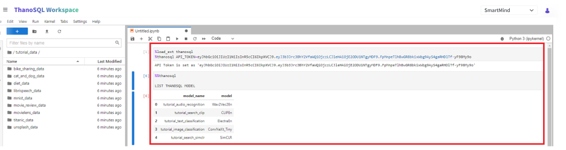
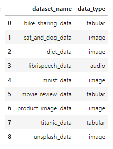

# __Lab 매뉴얼__

Lab은 [Jupyter Lab](https://github.com/jupyterlab/jupyterlab)을 기반으로 데이터 탐색, AI/ML 모델링 및 응용 프로그램 개발을 위한 다목적 환경을 제공합니다.

이 환경에서 **ThanoSQL**을 본격적으로 사용하기 위해서는 먼저 **ThanoSQL Magic**을 불러와야 합니다.

!!! tip ""
    상단의 실행 버튼을 누르거나, **Ctrl + Enter** 혹은 **Shift + Enter** 단축키로도 실행할 수 있습니다.

## __1. ThanoSQL Magic 불러오기__

아래 명령으로 ThanoSQL Magic 확장 프로그램을 불러옵니다.

```sql
%load_ext thanosql
```
## __2. API_TOKEN 설정하기__

**워크스페이스 설정 페이지 - Developer - API Token - 복사 버튼**으로 얻은  API_TOKEN을 다음과 같이 설정합니다.


```sql
%thanosql API_TOKEN=<발급받은_API_TOKEN>
```

ex)

```sql
%thanosql API_TOKEN=eyGVFDdfafddvczs
```

!!! tip "생성된 API 토큰을 이용하여 ThanoSQL의 모든 REST API를 사용하실수 있습니다"
    ThanoSQL에서 REST API 사용에 대한 자세한 내용은 [참조 페이지의 __ThanoSQL REST API Reference__](../../../../how-to_guides/reference/#rest-api)에서 확인하세요.


## __3. LIST 쿼리 구문으로 ThanoSQL 모델 / 데이터 세트 목록 확인하기__

**ThanoSQL**을 사용할 모든 준비가 끝났습니다.

아래 ThanoSQL문을 실행시키면 Pre-built된 ThanoSQL 모델 목록을 확인할 수 있습니다.

```sql
%%thanosql
LIST THANOSQL MODEL
```

[](../../../../img/getting_started/img8.png)

아래 ThanoSQL문을 실행시키면 각 튜토리얼에서 사용된 데이터 세트 리스트를 확인할 수 있습니다.

```sql
%%thanosql
LIST THANOSQL DATASET
```

[](../../../../img/getting_started/img9.png)

!!! notice "ThanoSQL의 쿼리문 작성 방법"
    ThanoSQL에서 쿼리문을 작성하는 방법에는 line 작성 방법과 cell 작성 방법이 있습니다.  

    - line: `%thanosql` 입력 후 현재 라인에 이어서 쿼리를 작성합니다. 쿼리 결과가 DataFrame 형식으로 반환되어 변수에 저장됩니다. 이후 Python 변수처럼 똑같이 프로그래밍이 가능합니다.

    ```
    df = %thanosql SELECT id, name FROM user
    ```

    - cell : `%%thanosql` 입력 후 줄을 바꿔서 자유롭게 여러 줄로 쿼리를 작성합니다. 다른 DBMS를 사용할 때와 같은 사용자 경험을 제공하며 테이블을 조회하거나 ThanoSQL 확장 문법을 실행할 때 사용합니다.

    ```
    %%thanosql
    SELECT
        id,
        name
    FROM user
    ```


## __4. 튜토리얼 가져오기__

[ThanoSQL 기술 문서에 있는 튜토리얼](../../../../tutorials/algorithm_list/)에서 튜토리얼 목록을 확인할 수 있습니다. 
아래 문을 실행시키면 ThanoSQL의 전체 튜토리얼들을 자신의 워크스페이스에 가지고 올 수 있습니다. 

```sql
!git clone https://github.com/smartmind-team/thanosql-tutorial.git
```

특정 튜토리얼만 자신의 워크스페이스로 가지고 오고 싶다면 아래와 같이 wget 메서드를 사용합니다.

!!!note "___튜토리얼 Github URL 리스트___"

```python
!wget [가져올 tutorial의 Github URL]
# 예시 
## wget https://raw.githubusercontent.com/smartmind-team/thanosql-tutorial/main/tutorial/thanosql_search/search_image_by_keyword.ipynb
```

| 튜토리얼      | URL                          |
| :---------: | :----------------------------------: |
| `키워드로 이미지 검색하기`       | https://raw.githubusercontent.com/smartmind-team/thanosql-tutorial/main/tutorial/thanosql_search/search_image_by_keyword.ipynb |
| `이미지로 이미지 검색하기`       | https://raw.githubusercontent.com/smartmind-team/thanosql-tutorial/main/tutorial/thanosql_search/search_image_by_image.ipynb  |
| `텍스트로 이미지 검색하기`    | https://raw.githubusercontent.com/smartmind-team/thanosql-tutorial/main/tutorial/thanosql_search/search_image_by_text.ipynb |
| `텍스트로 텍스트 검색하기`    | https://raw.githubusercontent.com/smartmind-team/thanosql-tutorial/main/tutorial/thanosql_search/search_text_by_text.ipynb |
| `텍스트로 비디오 검색하기`    | https://raw.githubusercontent.com/smartmind-team/thanosql-tutorial/main/tutorial/thanosql_search/search_video_by_text.ipynb |
| `Auto-ML을 사용하여 분류 모델 만들기`    | https://raw.githubusercontent.com/smartmind-team/thanosql-tutorial/main/tutorial/thanosql_ml/classification/automl_classification.ipynb |
| `이미지 분류 모델 만들기`    | https://raw.githubusercontent.com/smartmind-team/thanosql-tutorial/main/tutorial/thanosql_ml/classification/image_classification.ipynb |
| `텍스트 분류 모델 만들기`    | https://raw.githubusercontent.com/smartmind-team/thanosql-tutorial/main/tutorial/thanosql_ml/classification/text_classification.ipynb |
| `Auto-ML을 사용하여 예측 모델 만들기`    | https://raw.githubusercontent.com/smartmind-team/thanosql-tutorial/main/tutorial/thanosql_ml/regression/automl_regression.ipynb |
| `오디오 파일을 받아쓰는 음성 인식 모델 만들기`    | https://raw.githubusercontent.com/smartmind-team/thanosql-tutorial/main/tutorial/thanosql_ml/audio_recognition/speech_recognition.ipynb |
| `오디오 파일을 받아쓰는 음성 인식 모델 사용하기`    | https://raw.githubusercontent.com/smartmind-team/thanosql-tutorial/main/tutorial/thanosql_ml/audio_recognition/speech_recognition2.ipynb |
| `시각 질의 응답 모델 사용하기`    | https://raw.githubusercontent.com/smartmind-team/thanosql-tutorial/main/tutorial/thanosql_ml/question_answering/visual_question_answering.ipynb |
| `시계열 예측 모델 만들기`| https://raw.githubusercontent.com/smartmind-team/thanosql-tutorial/main/tutorial/thanosql_ml/timeseries/timeseries_forecasting.ipynb |
| `사용자의 모델을 ThanoSQL에서 사용하기`| https://raw.githubusercontent.com/smartmind-team/thanosql-tutorial/main/tutorial/thanosql_ml/udm_tutorial.ipynb |


