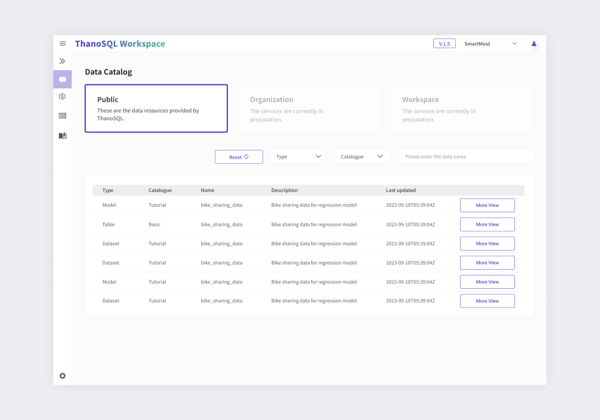
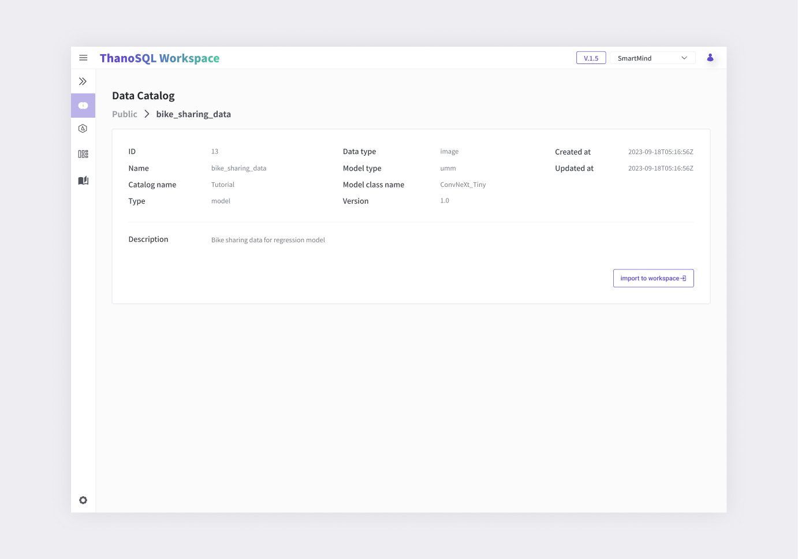

# **Data Catalog Manual**

The Data Catalog allows you to view and manage datasets, models, tables and other data that can be used in ThanoSQL.

## **Data Catalog page Overview**

You can view catalogs by data catalog group. Select a catalog group, and use filters to search for only the data you want.

[{: style="max-height:none"}](../../../img/getting_started/paas/workspace/dc_img_1.png)

- Data Catalog Groups

    - Public: The default catalog group provided by ThanoSQL

    - Organization: A group for managing data at the organization/workspace level

    - Workspace: The data catalog group for the user's workspace

      *Organization and Workspace are services currently in preparation.*

- Filter: You can search and filter by catalog type, catalog name, and data name.

- Details View: You can see detailed information for each data.

### **Data DetailView**   

It provides detailed information about the selected data, and the 'Import to Workspace' functionality allows you to import the data into your workspace.

[{: style="max-height:none"}](../../../img/getting_started/paas/workspace/dc_img_2.png)

