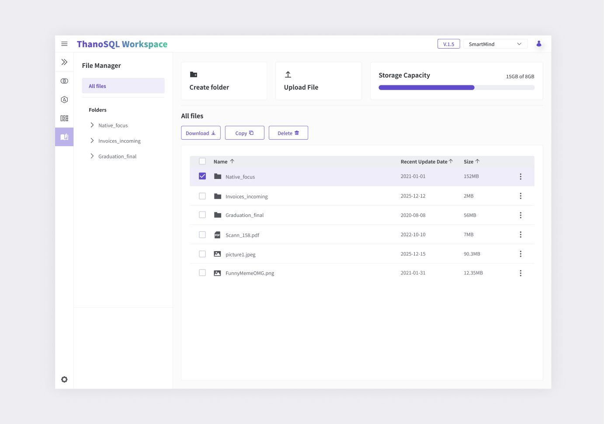

# **File Manager Manual**

The File Manager provides the ability to upload and manage files in your Workspace storage space. Users can create, move, copy, and delete files and folders. Additionally, you can check the storage capacity and file attributes, allowing for efficient file management.

!!! note ""
    The root folder is the same as the Lab.

[{: style="max-height:none"}](../../../img/getting_started/paas/workspace/fm_img_1.png)

