# **Query Manager Manual**

The Query Manager enables you to execute ThanoSQL queries and analyze results through a user interface that is similar to a Database Management System (DBMS). It offers an intuitive way to understand the schema and table structure of the workspace database. You can effortlessly manage and view previous query results with query logs. Additionally, the Query Manager provides a data viewer for analyzing unstructured data, such as images and videos, within query execution results.

**Key Features**

- Execution of both ThanoSQL and regular SQL commands
- 'Table Schema' / 'Preview' of data tables
- Query logs
- Data viewer

## **Query Manager Page Overview**

The Query Manager page consists of three main sections.

[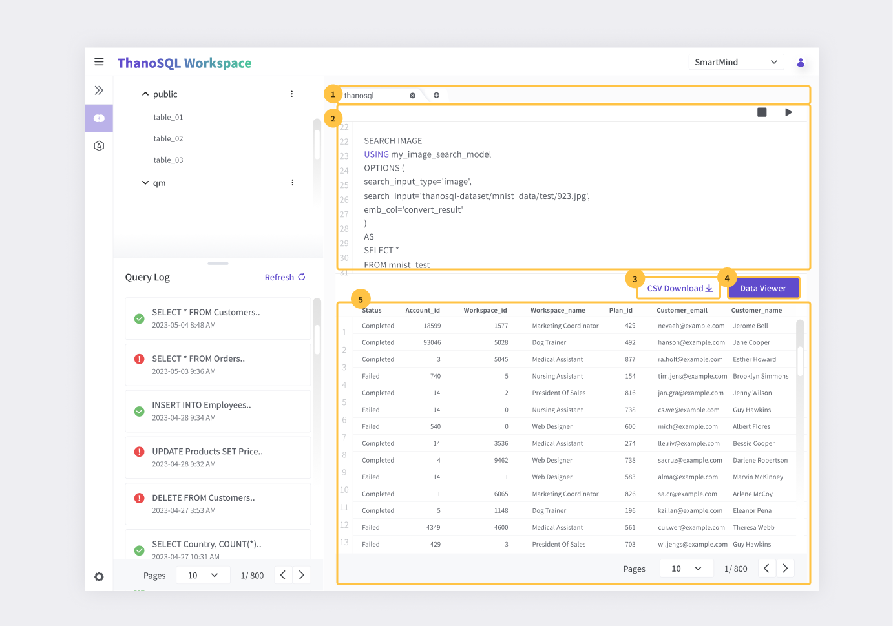{: style="max-height:none"}](../../../img/getting_started/paas/workspace/qm_img_1.png)

① Query Editor

② Database Explorer

③ Query Logs

### **Query Editor**

Execute ThanoSQL queries and view the results in a table format.

[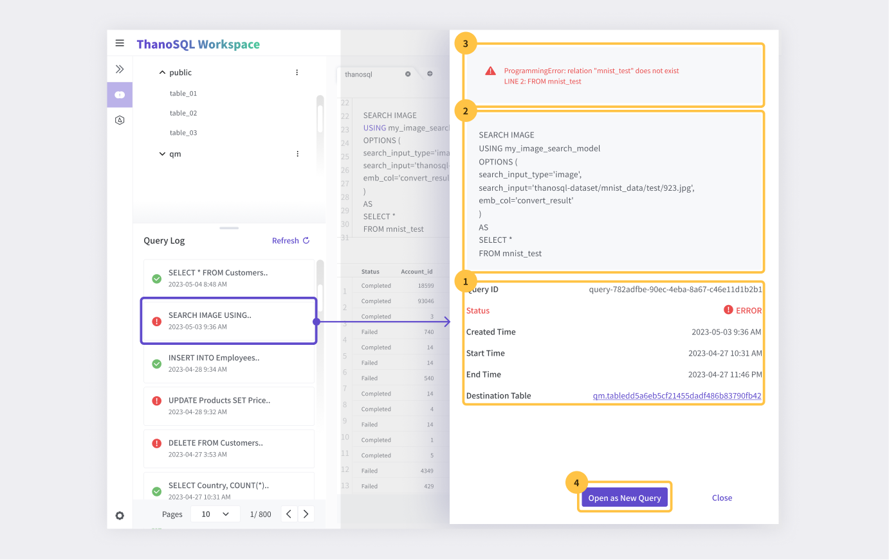{: style="max-height:none"}](../../../img/getting_started/paas/workspace/qm_img_2.png)

① Tabs: Write queries and view results in different tabs. You can add or delete tabs as needed.

② Query Input Area: Input queries and execute/stop them. Supports [keyboard shortcuts](#keyboard-shortcuts).

③ CSV Download: Download result as a CSV file.

④ [Data Viewer](#data-viewer) : Used for analyzing unstructured data like images and videos.

⑤ Result Table: Displays query results as a table.

#### **Data Viewer**

The Data Viewer feature allows you to view unstructured data within the result table. You can select a column that contains the path to the unstructured file and choose the file format (image, video, audio) to display the unstructured data. The pagination feature at the bottom allows you to adjust the number of items displayed per page and navigate to different pages.

!!! tip
    The Data Viewer displays unstructured data based on the file path. Therefore, the stored path value must actually exist in the workspace. (Sometimes it may not appear due to issues such as proxies.)

#### **Keyboard Shortcuts**

Here are the shortcuts supported in the query editor:

| Action                                        | Key Combination (Windows/Linux) | Key Combination (Mac OS) |
| --------------------------------------------- | ------------------------------- | ------------------------ |
| Execute the current or highlighted query      | Ctrl+Enter                      | Cmd + Enter              |
| Auto-complete the current word                | Tab or Ctrl + Space             | Tab or Cmd + Space       |
| Add a comment to the current or selected line | Ctrl+/                          | Cmd + /                  |
| Access the editor menu                        | Shift + F10                     | Shift + F10              |
| Access the list of editor shortcuts           | F1                              | F1                       |

!!! tip
    The query editor uses Monaco Editor, which is also used in VSCode. Most shortcuts are the same as those used in VSCode. Please refer to the [link](https://en.docs.monaca.io/products_guide/monaca_ide/editor){:target="\_blank"} for a list of Monaco Editor's shortcuts.

### **Database Explorer**

You can access the [schema](https://www.postgresql.org/docs/current/ddl-schemas.html) and table configuration information of your workspace database.

Each workspace provides the public schema and temporary result tables by default. Queries that do not specify a schema will refer to tables in the public schema. Any query executed in the query editor that produces results in tabular form will be stored as a `Temporary Result Table` with a random table name. This allows you to reuse previous query results as needed.

#### **Table / View Information**

The Database Explorer provides information about tables/views within the schema. Click on the table/view name to see the following information.

##### Table Schema

You can check the column name, data type, and nullability of the table/view.

[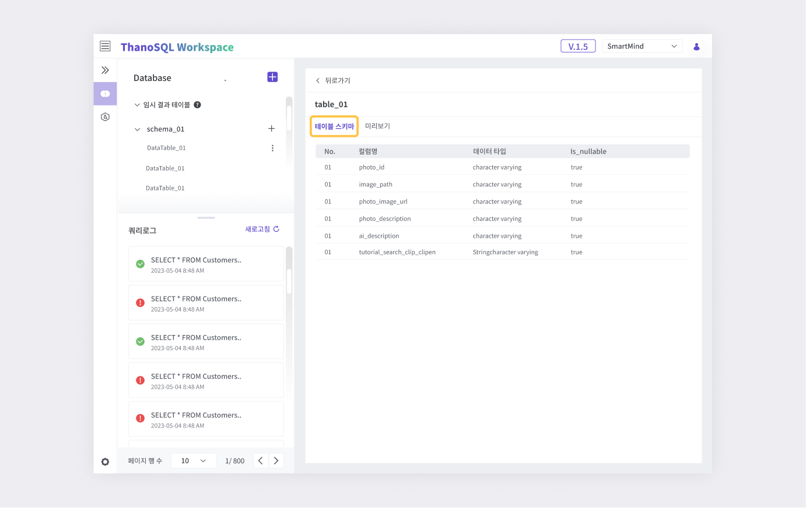{: style="max-height:none"}](../../../img/getting_started/paas/workspace/qm_img_14.png)

##### Preview

You can quickly see the contents of the selected table/view.

!!! warning
    You cannot edit data tables in the preview.

[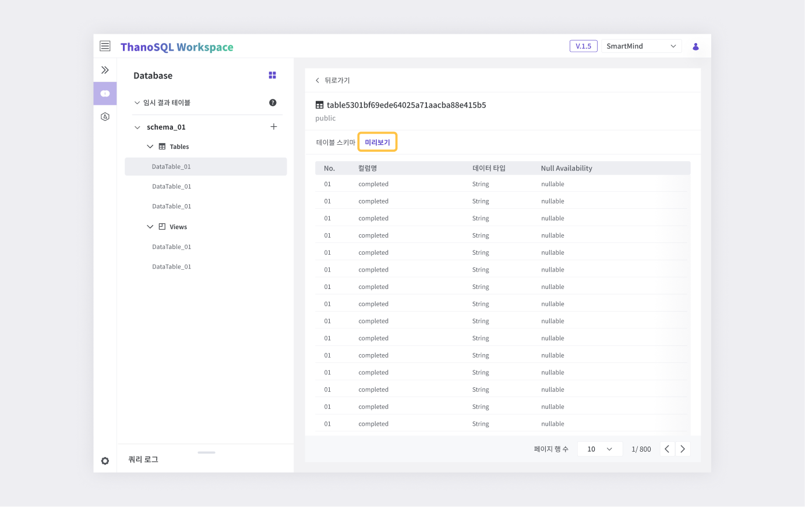{: style="max-height:none"}](../../../img/getting_started/paas/workspace/qm_img_15.png)

##### Definition

You can see the definition (query statement) of the selected view.

[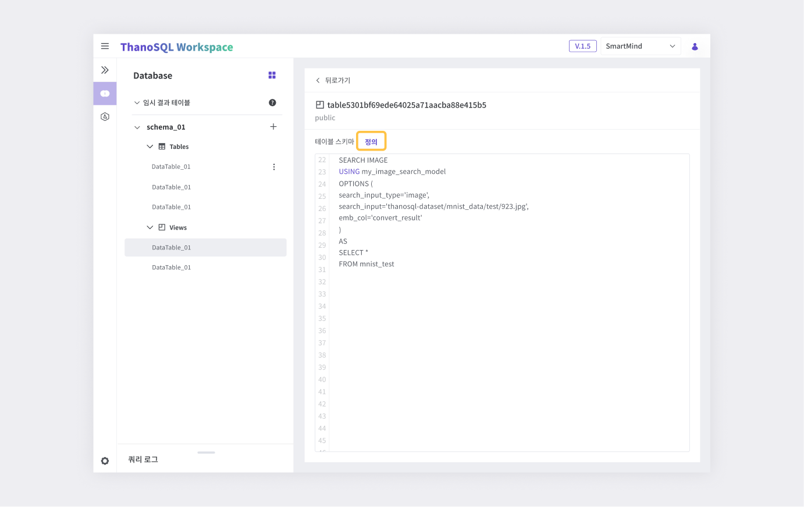{: style="max-height:none"}](../../../img/getting_started/paas/workspace/qm_img_32.png)

#### **Adding Data**

This is a feature that allows you to add new tables and schemas to the database. You can open the Add Table Data menu by clicking the **`+`** button located in the top right corner of the database explorer.

[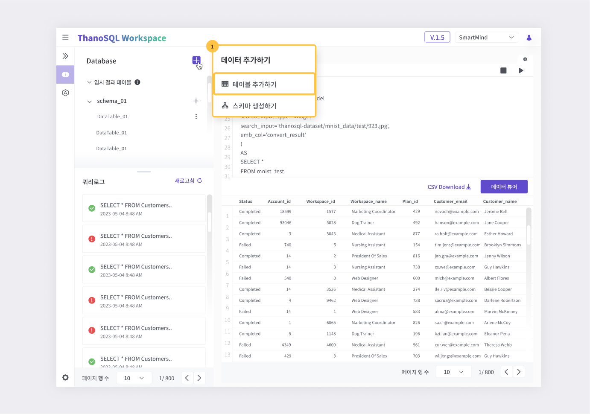{: style="max-height:none"}](../../../img/getting_started/paas/workspace/qm_img_3.png)

##### **Add Table**

Add a table to the database. Choose one of the following data source upload methods to proceed. (You can also add a table using the right **+** button in each schema)

1. Create New Table Manually
2. Local File Upload

**1. Create New Table Manually**

In the Add Table window, select **Create New Table** and then click the Next button.

[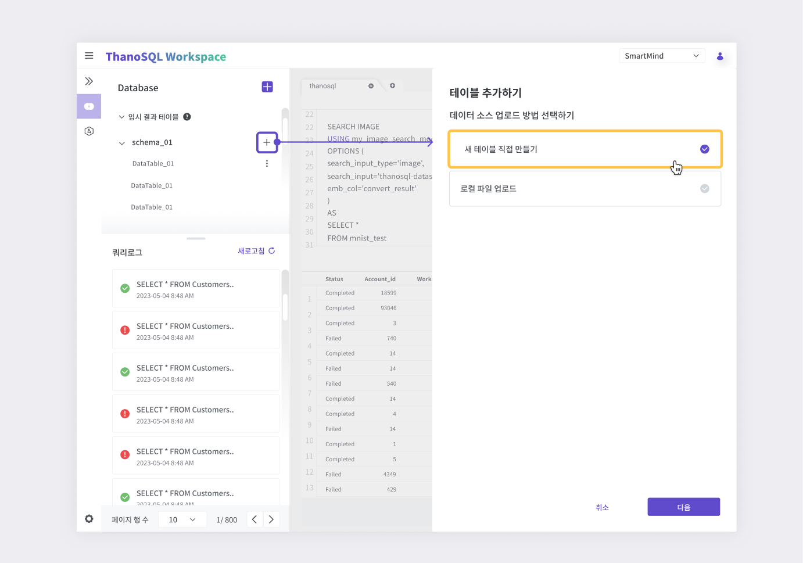{: style="max-height:none"}](../../../img/getting_started/paas/workspace/qm_img_5.png)

Enter the information for the table you want to create.

[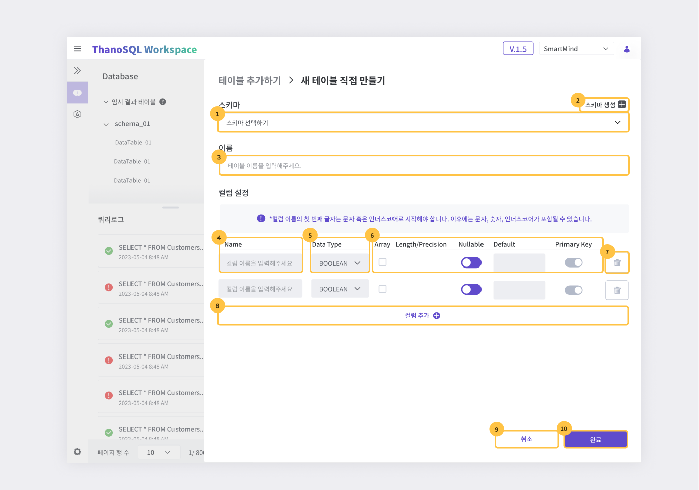{: style="max-height:none"}](../../../img/getting_started/paas/workspace/qm_img_6.png)

① Select the schema in which to create the table.

② If the desired schema doesn't exist, you can create a new one.

③ Enter the name of the table you want to create. It can include letters, numbers, and underscores, but it cannot start with a number. You cannot create tables with duplicate names within the same schema.

④ Enter the name of each column that makes up the table. This is a required field, and you cannot create columns with duplicate names within the same table.

⑤ You can select the data type for the respective column. This field must be filled in.

⑥ Depending on the data type, the available options for adjustment may vary, allowing you to configure the column according to its intended purpose.

⑦ Deleting the respective column.

⑧ Adding a new column.

⑨ Cancelation of Create New Table Manually.

⑩ Completion of Create New Table Manually.

**2. Local File Upload**

After opening the Add Table window, select Local File Upload and click Next.

[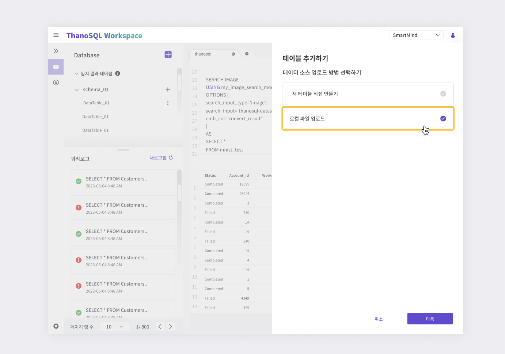{: style="max-height:none"}](../../../img/getting_started/paas/workspace/qm_img_7.png)

Please provide the following information

[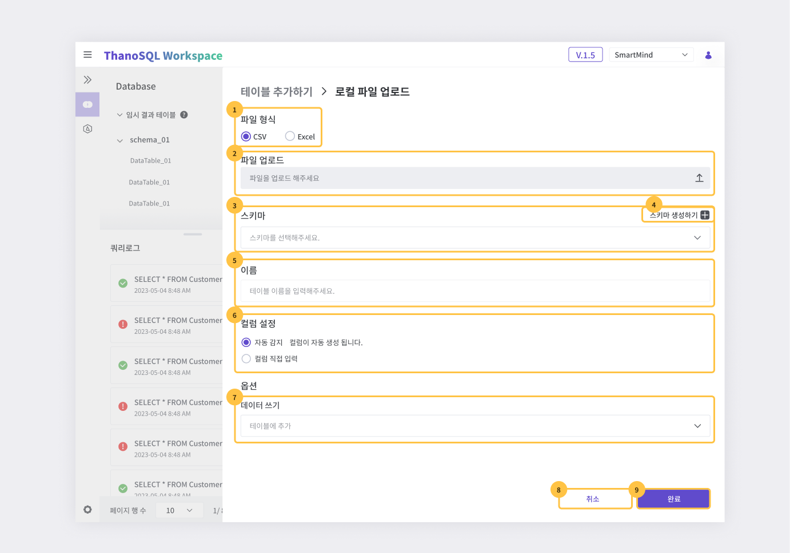{: style="max-height:none"}](../../../img/getting_started/paas/workspace/qm_img_8.png)

① You can choose the file format (CSV, Excel, etc.). The allowed file extensions are as follows:

- CSV: .csv
- Excel: .xls, .xlsx, .xlsm, .xlsb, .odf, .ods, .odt

② Upload a file that matches the format.

③ Select the schema in which to create the table.

④ If the desired schema does not exist, you can create a new one.

⑤ Enter the name of the table you want to create. The name can include letters, numbers, and underscores, but it cannot start with a number. You cannot create tables with duplicate names within the same schema.

⑥ Select the column configuration method: You can choose to automatically detect columns from the uploaded file or input them manually.

- Auto Detection: Automatically detects the columns in the uploaded file.
- Manual Input: Input columns directly, similar to creating a new table from scratch.

⑦ You can configure the data writing options as follows:

- Write if Empty: Writes data only when the table does not exist already.
- Append to Table: Adds data on top of existing contents if the table already exists.
- Overwrite Table: Overwrites the contents of the table if it already exists.

⑧ Cancelation of Local File Upload.

⑨ Completion of Local File Upload.

##### **Create Schemas**

In the Add Data menu, click on Create Schema to generate a new schema.

[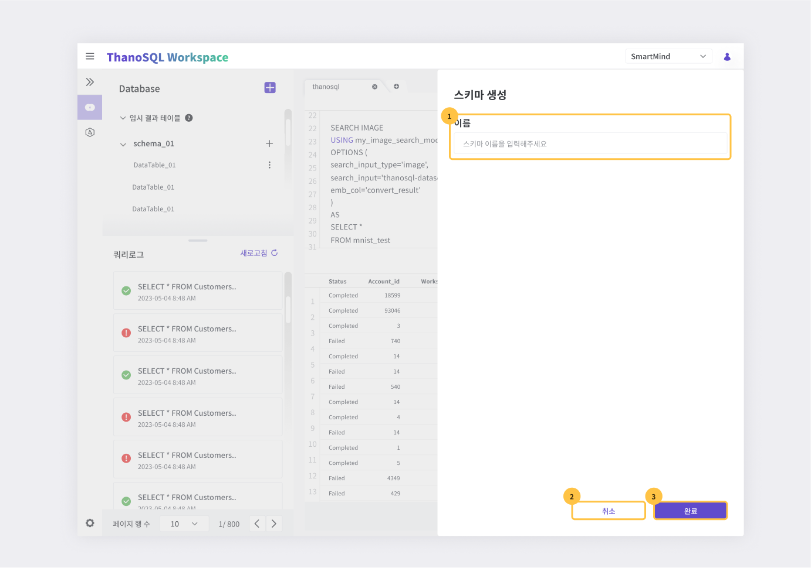{: style="max-height:none"}](../../../img/getting_started/paas/workspace/qm_img_12.png)

① Enter the name of the schema you want to create. The schema name can include letters, numbers, and underscores, but it cannot start with a number. You cannot create schemas with duplicate names within the same database.

② Cancelation of Create Schema.

③ Completion of Create Schema.

#### Delete Table

You can delete a specific table by clicking the right-hand menu button for that table in the database explorer.

[{: style="max-height:none"}](../../../img/getting_started/paas/workspace/qm_img_13.png)

### **Managing Templates**

You can manage table templates and query templates. Move by clicking the menu button located in the upper right corner of the Database Explorer.

#### **Table Template**    

[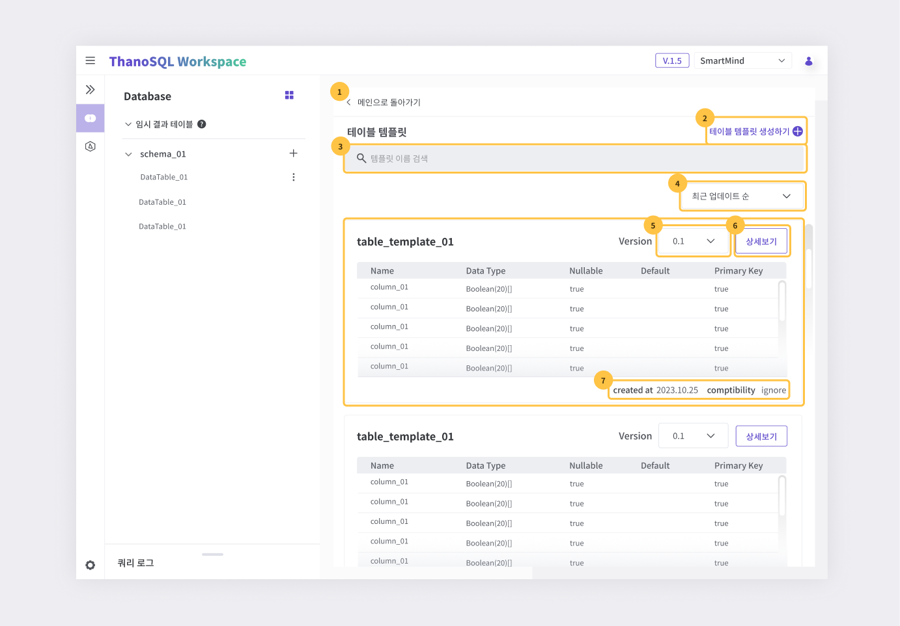{: style="max-height:none"}](../../../img/getting_started/paas/workspace/qm_img_18.png)

① Return to the query editor. 

② Go to the "Create Table Template" page to create a new table template.

③ Enter a table template name to find the table template you want. 

④ Sort by creation date or name (ascending or descending).

⑤ Look up the versions of the table template.

⑥ View table template details. 

⑦ Compatibility and creation date of the table template.

**Creating table templates** 

[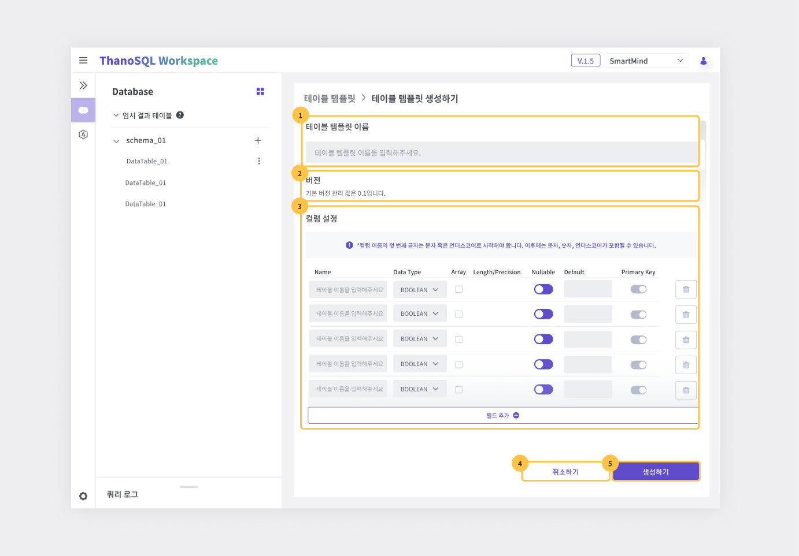{: style="max-height:none"}](../../../img/getting_started/paas/workspace/qm_img_19.png)

① Enter the name of the table template to save. 

② When you create a new table template, the version is fixed at 1.0. 

③ Fill in the column information to include in the table template. 

④ Cancel the creation of the table template.

⑤ Confirm the creation of the table template.

**Viewing table template details**

[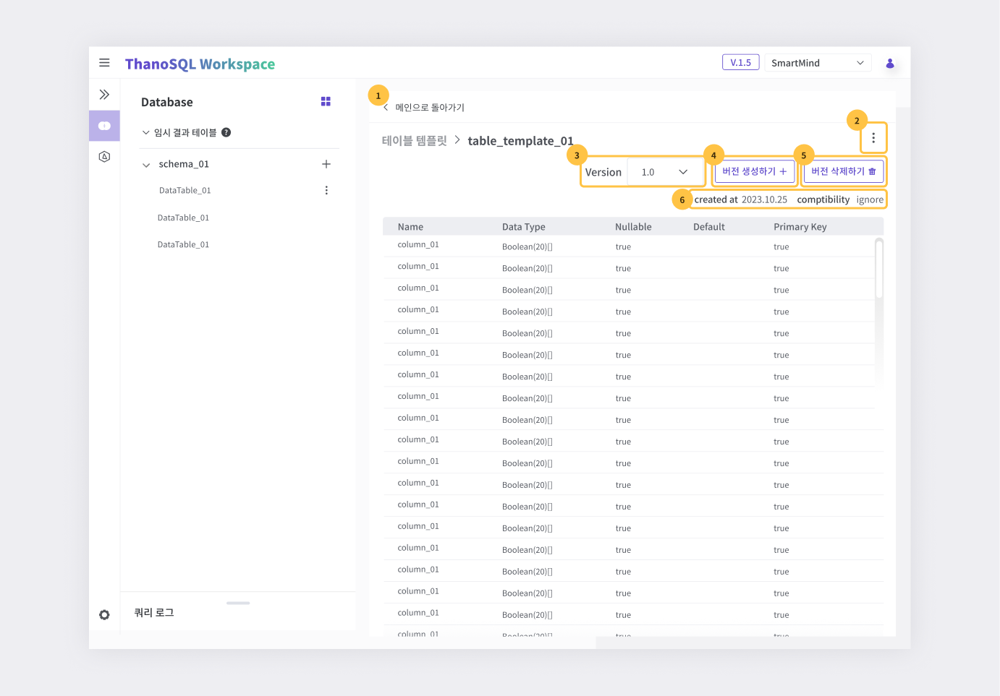{: style="max-height:none"}](../../../img/getting_started/paas/workspace/qm_img_20.png)

① Return to the query editor. 

② Delete the table template. 

③ Select the version of the table template.

④ Create a new version of the table template.

⑤ Delete the corresponding version of the table template.

⑥ Compatibility and creation date of the table template.

**Modifying table templates**

[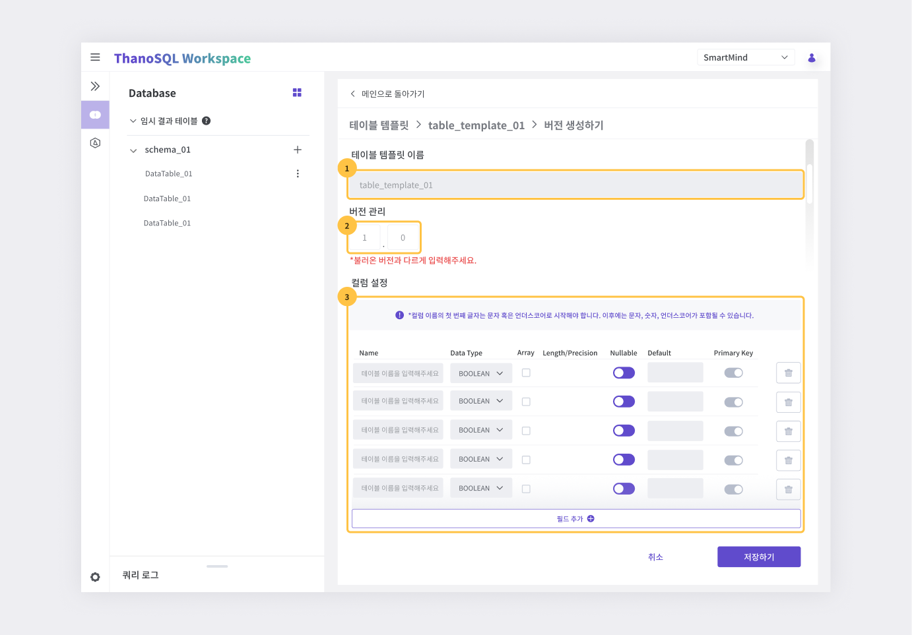{: style="max-height:none"}](../../../img/getting_started/paas/workspace/qm_img_21.png)

① Table template name to indicate the current table template.

② Enter new version (it should not be the same as the previous version).

③ Add, delete, or modify columns.

**Saving table templates**

[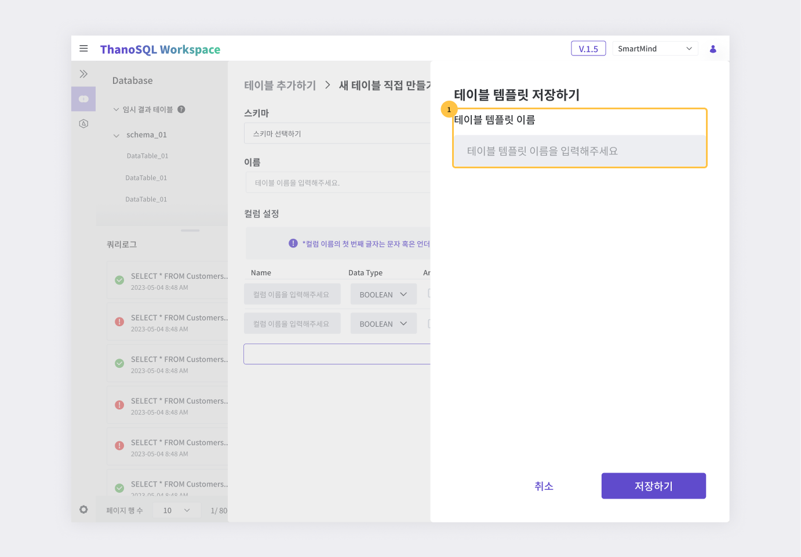{: style="max-height:none"}](../../../img/getting_started/paas/workspace/qm_img_22.png)

① Enter the name of the table template to save.

**Importing table templates**

[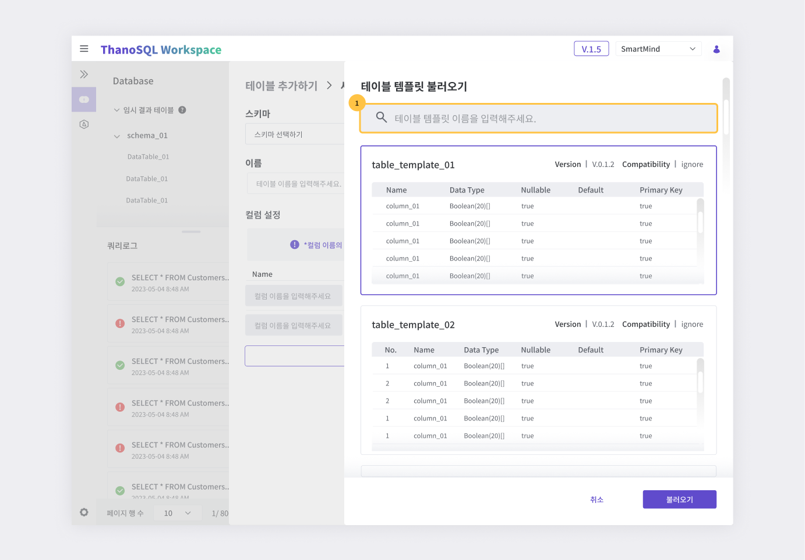{: style="max-height:none"}](../../../img/getting_started/paas/workspace/qm_img_23.png)

① You can search by name to find the table template to import.

#### **Query Template**

Use the query tool to save/recall query templates.

[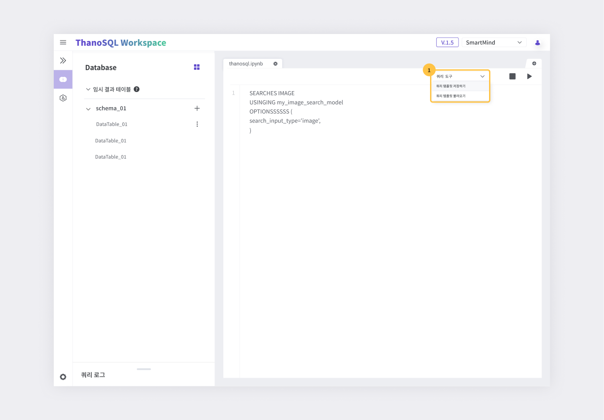{: style="max-height:none"}](../../../img/getting_started/paas/workspace/qm_img_24.png)

**Saving query templates**

[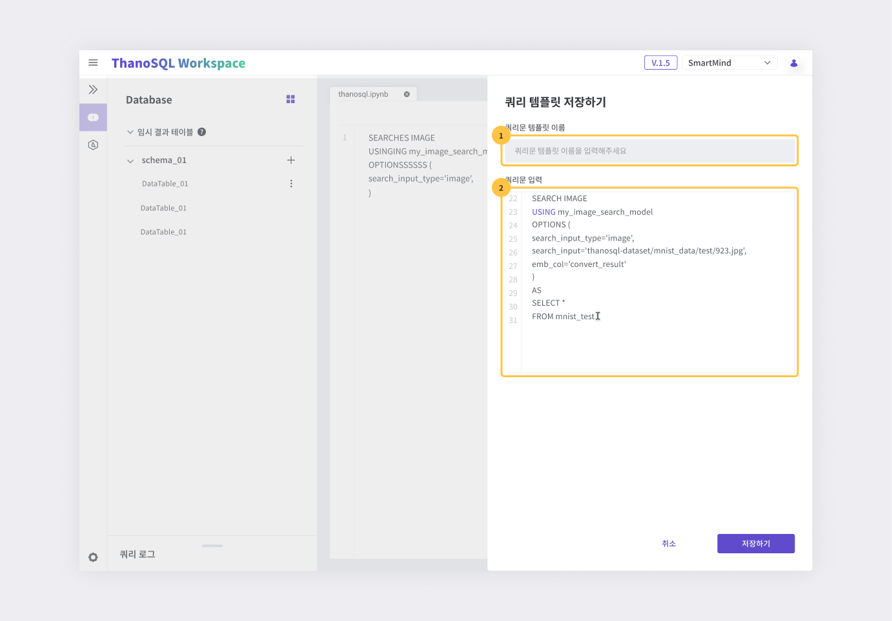{: style="max-height:none"}](../../../img/getting_started/paas/workspace/qm_img_25.png)

① Query Template Name: Enter the name of the query template you want to save.

② Query Statement: Type the query statement you want to save.

[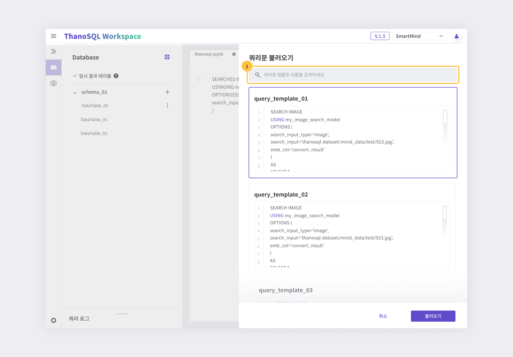{: style="max-height:none"}](../../../img/getting_started/paas/workspace/qm_img_26.png)

① Query Template Search Bar: Search by name to find saved query templates.

**Managing query templates**

Click the **`Draw'** button located to the right of Database in the Database Explorer to open the Add Table Data menu and click Manage Query Templates.

[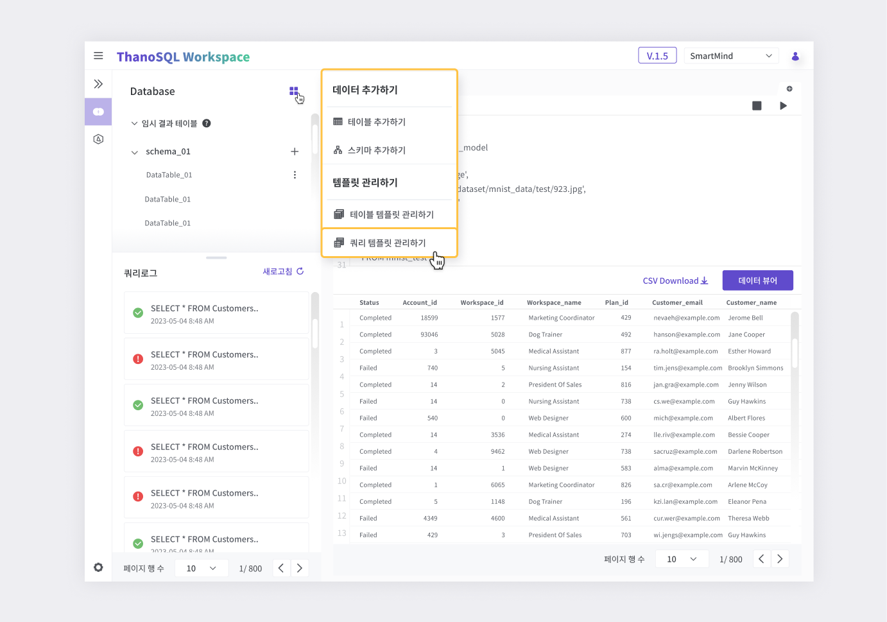{: style="max-height:none"}](../../../img/getting_started/paas/workspace/qm_img_27.png)

[{: style="max-height:none"}](../../../img/getting_started/paas/workspace/qm_img_28.png)

① Navigate to the page where you can create query templates.

② You can enter a name for the query template to find the desired query template.  

③ Sort by modification date, name by name (upward, downward).

④ Check the date of latest update.  

⑤ Go to the "View Template Details" page.

**Creating query templates**

[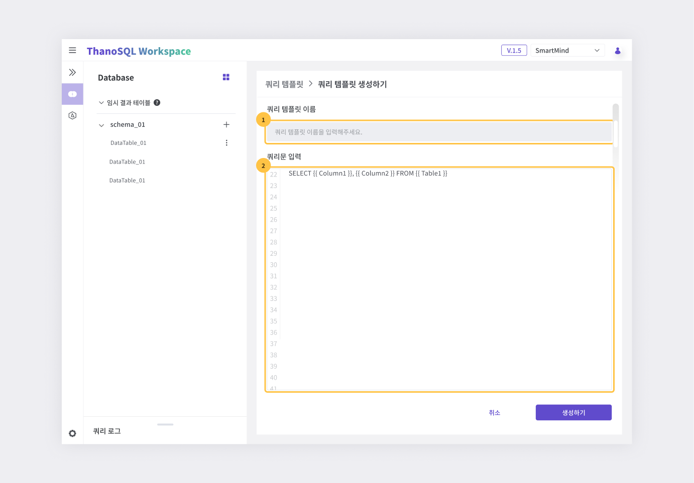{: style="max-height:none"}](../../../img/getting_started/paas/workspace/qm_img_29.png)

① Type the name of the query template that you want to save. 

② Type the query statement you want to save.

**View query template details**

[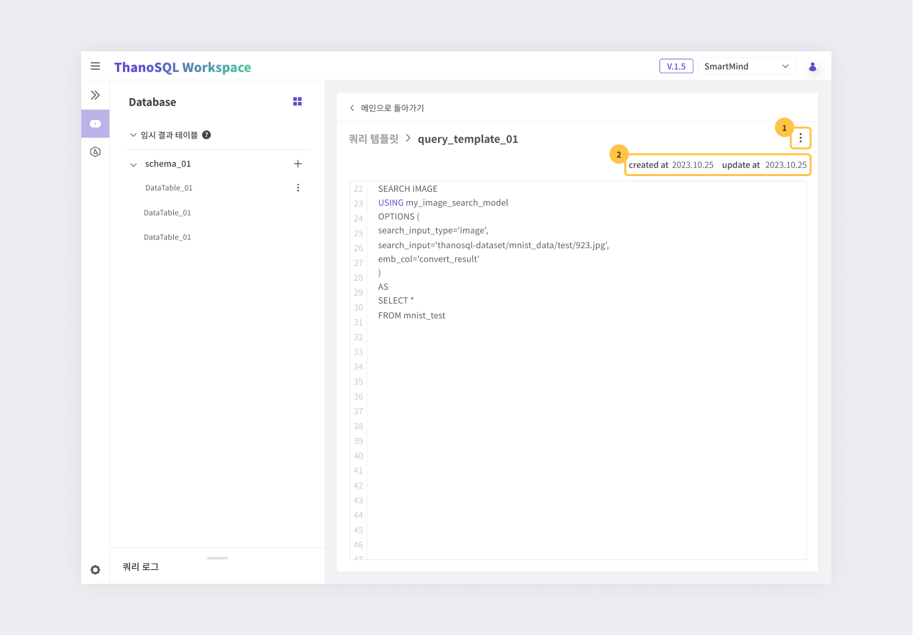{: style="max-height:none"}](../../../img/getting_started/paas/workspace/qm_img_30.png)

① Delete or modify the query template. 

② Date of creation and date of update.

**To modify a query template**

[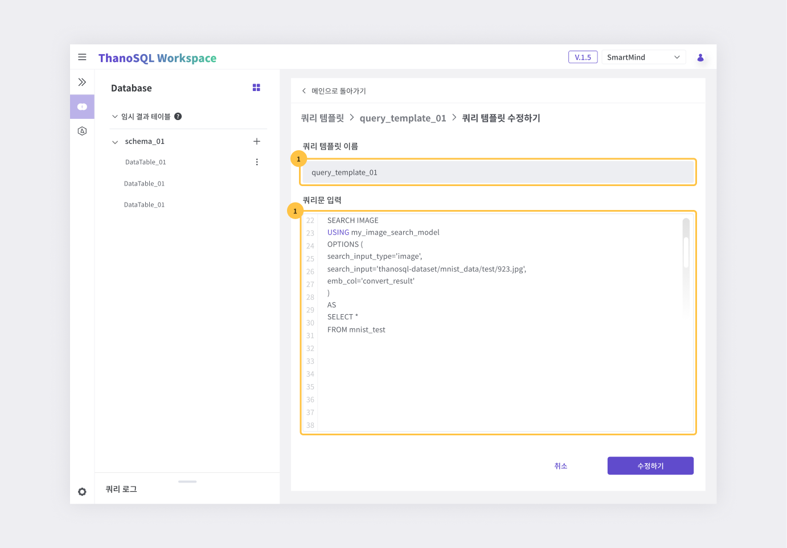{: style="max-height:none"}](../../../img/getting_started/paas/workspace/qm_img_31.png)

① Modify the name of the query template. 

② Modify the query statement.

### **Query Logs**

All queries executed in Query Manager are logged and can be viewed in the Query Logs section. They are listed in descending order of creation time. The logs show the executed query statement and whether the execution was successful.

[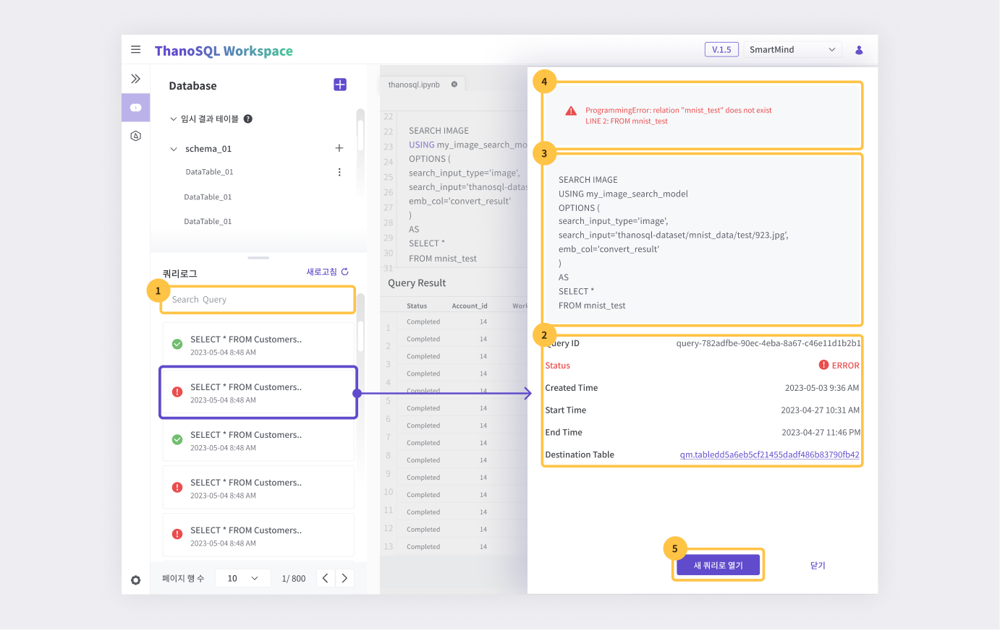{: style="max-height:none"}](../../../img/getting_started/paas/workspace/qm_img_16.png)

#### Query Search Functionality

① You can enter a keyword to search for query logs that were executed with similar query syntax.

#### Detailed Information Pane

Click on a query log to view its detailed information on the right side.

② Query Information: Displays the ID, success status, creation time, start execution time, end time, and destination table name of the query.

③ Query Statement: Displays the executed query statement.

④ Error Message: Displays error messages that occurred during query execution.

⑤ Open as New Query: Opens the query editor tab with the content of the clicked query.
