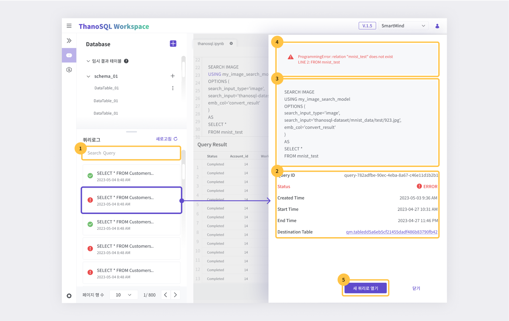

# **Query Manager Manual**

The Query Manager enables you to execute ThanoSQL queries and analyze results through a user interface that is familiar and similar to a Database Management System (DBMS). It offers an easy way to understand the schema and table structure of the workspace database. You can effortlessly manage previous query results through query logs. Additionally, it provides a data viewer for analyzing unstructured data, such as images and videos, within query execution results.

**Key Features**

- Execution of both ThanoSQL and basic SQL commands
- 'Table Schema' / 'Preview' of data tables
- Query logs
- Data viewer

## **Query Manager Page Overview**

The Query Manager page consists of three main sections.

[{: style="max-height:none"}](../../../../ko/img/getting_started/paas/workspace/qm_img_1.png)

① Query Editor

② Database Explorer

③ Query Logs

### **Query Editor**

Execute ThanoSQL queries and view the results in a table format.

[{: style="max-height:none"}](../../../../ko/img/getting_started/paas/workspace/qm_img_2.png)

① Tabs: Write queries and view results in different tabs. You can add or delete tabs as needed.

② Query Input Area: Input queries and execute/stop them. Supports [Keyboard Shortcuts](#keyboard-shortcuts).

③ CSV Download: Download result tables in CSV format.

④ [Data Viewer](#data-viewer) : Used for analyzing unstructured data like images and videos.

⑤ Result Table: Displays query results in a table format.

#### **Data Viewer**

The Data Viewer feature allows you to view unstructured data within the result table. You can select a column that contains the path to the unstructured file and choose the file format (image, video, audio) to display the unstructured data. The pagination feature at the bottom allows you to adjust the number of items displayed per page and navigate to different pages.

!!! warning
    The Data Viewer displays unstructured data based on the file path. Therefore, the stored path value must actually exist in the workspace. (Sometimes it may not appear due to issues such as proxies.)

#### **Keyboard Shortcuts**

Here are the shortcuts supported in the query editor:

| Action                                        | Key Combination (Windows/Linux) | Key Combination (Mac OS) |
| --------------------------------------------- | ------------------------------- | ------------------------ |
| Execute the current or selected query         | Ctrl+Enter                      | Cmd + Enter              |
| Auto-complete the current word                | Tab or Ctrl + Space             | Tab or Cmd + Space       |
| Add a comment to the current or selected line | Ctrl+/                          | Cmd + /                  |
| Access the editor menu                        | Shift + F10                     | Shift + F10              |
| Access the list of editor shortcuts           | F1                              | F1                       |

!!! tip
    The query editor uses the Monaco Editor, which is also used in VSCode. Most shortcuts are the same as those used in VSCode. Refer to the [link](https://en.docs.monaca.io/products_guide/monaca_ide/editor){:target="_blank"} for the Monaco Editor's shortcut list.

### **Database Explorer**

View schema and table configuration information of the workspace database. Each workspace provides default 'public' and temporary result tables. Queries that do not specify a schema refer to tables in the 'public' schema. Any queries with results in tabular form are saved in temporary result tables with arbitrary names. This allows you to reuse previous table execution results at any time.

#### **Table Information**

The database explorer provides information about tables within the schema. Click on a table name to see the following information:

**Table Schema**

View column names, data types, and nullability of columns in the data table.

[{: style="max-height:none"}](../../../../ko/img/getting_started/paas/workspace/qm_img_14.png)

**Preview**

Quickly grasp the content of the data table.

!!! warning
    Editing data tables is not possible in the preview.

[{: style="max-height:none"}](../../../../ko/img/getting_started/paas/workspace/qm_img_15.png)

#### **Adding Data**

You can add new tables and schemas to the database.

##### **Adding Tables**

Click the **`+`** button located to the right of the Database in the database explorer to open the menu for adding table data, then click 'Add Table'.

[{: style="max-height:none"}](../../../../ko/img/getting_started/paas/workspace/qm_img_3.png)

**Create a New Table Directly**

After opening the add table window, select 'Create a New Table Directly' and click Next.

[{: style="max-height:none"}](../../../../ko/img/getting_started/paas/workspace/qm_img_4.png)

You can also add data using the + button to the right of the schema.

[{: style="max-height:none"}](../../../../ko/img/getting_started/paas/workspace/qm_img_5.png)

[{: style="max-height:none"}](../../../../ko/img/getting_started/paas/workspace/qm_img_6.png)

① Select Schema: Choose the schema to create the table in.

② Create Schema: Create a new schema.

③ Name(table): Enter the name for the table to be created. Table names can include letters, numbers, and underscores, but cannot start with a number. Duplicate table names cannot be created within the same schema.

④ Name(column): Enter the column name. This is a required field, and duplicate column names cannot be created within the same table.

⑤ Data Type: Select the data type for the column. This is a required field.

⑥ Column Options: Depending on the Data Type, options can be adjusted, and settings can be customized according to the column's purpose.

⑦ Column Delete Button: Delete the column.

⑧ Column Add Button: Add a new column.

⑨ Cancel Button: Cancel creating a new table directly.

⑩ Complete Button: Complete creating a new table directly.

**Adding Tables via Local File Upload**

After opening the add table window, select 'Local File Upload' and click Next.

[{: style="max-height:none"}](../../../../ko/img/getting_started/paas/workspace/qm_img_7.png)

[{: style="max-height:none"}](../../../../ko/img/getting_started/paas/workspace/qm_img_8.png)

① File Format Selection: Choose between CSV and Excel. For CSV, only .csv files can be uploaded. For Excel, only .xls, .xlsx, .xlsm, .xlsb, .odf, .ods, and .odt files can be uploaded.

② File Upload: Upload the file according to the selected format.

③ Schema Selection: Choose the schema in which to create the table.

④ Create Schema: Press the Create Schema button to create a new schema, useful for initial usage or when you want to create a new schema.

⑤ Name: Enter the name for the table to be created. Table names can include letters, numbers, and underscores, but cannot start with a number. Duplicate table names cannot be created within the same schema.

⑥ Column Settings

You can automatically detect the columns in the uploaded file or manually input them.

- Auto Detection: Automatically detects the columns in the uploaded file.
- Manual Input: Manually input the columns.

[{: style="max-height:none"}](../../../../ko/img/getting_started/paas/workspace/qm_img_9.png)

⑦ Options

- Data Writing: Select data writing options.

⑧ Cancel Button: Cancel local file upload.

⑨ Complete Button: Complete local file upload.

##### **Create Schemas**

You can create a new schema.

Click the **`+`** button located to the right of the Database in the database explorer to open the menu for adding table data, then click 'Create Schema'.

[{: style="max-height:none"}](../../../../ko/img/getting_started/paas/workspace/qm_img_9.png)

[{: style="max-height:none"}](../../../../ko/img/getting_started/paas/workspace/qm_img_12.png)

① Schema Name: Enter the name for the schema to be created. Schema names can include letters, numbers, and underscores, but cannot start with a number. Duplicate schema names cannot be created within the same database.

② Cancel Button: Cancel schema creation.

③ Complete Button: Complete schema creation.

#### Delete Table

[{: style="max-height:none"}](../../../../ko/img/getting_started/paas/workspace/qm_img_13.png)

### **Query Logs**

All queries executed in the Query Manager are logged and can be viewed in the query logs section. They are listed in descending order of creation time. The logs show the executed query statement and whether the query was successful.

[{: style="max-height:none"}](../../../../ko/img/getting_started/paas/workspace/qm_img_16.png)

#### Query Search

When you input a query statement, it searches for log entries with similar query statements.

#### Detailed Information Pane

Click on a query log to view its detailed information on the right side.

① Query Information: Displays the ID, success status, creation time, execution time, end time, and target table name of the query.

② Query Statement: Displays the executed query statement.

③ Error Message: Displays error messages that occurred during query execution.

④ Open as New Query: Opens the query editor tab with the content of the clicked query.