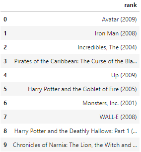
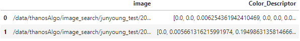
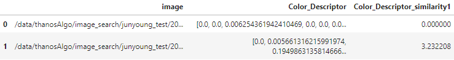
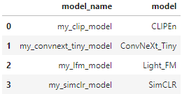
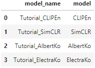

# ThanoSQL Syntax
## (안내 가이드) 쿼리 구문 사용 튜토리얼

**[이전 문서 - ](https://github.com/smartmind-team/thanosql-docs/blob/sunkeun/docs/tutorials/thanosql_ml/tabular/classification/automl_classification.md)** <br>| **[다음 문서 - ](https://github.com/smartmind-team/thanosql-docs/blob/indoo2/docs/tutorials/thanosql_ml/tabular/recommendation/lv1_lfm_kor_0_1.md)**

## 시작 전 사전정보

- 튜토리얼 난이도 : ★★☆☆☆
- 읽는 시간 : 10분
- 사용 언어 : [SQL](https://ko.wikipedia.org/wiki/SQL) (100%)
- 마지막 수정날짜 : 2022-06-01

<br>

## 튜토리얼 소개
ThanoSQL에서 사용하는 문법들의 기능을 모아두었습니다. 각 문법의 사용 방법과 옵션을 제공합니다. 튜토리얼 문서와 함께 활용하면서 나만의 모델을 만들고 배포해 보세요. <br>
 * ThanoSQL은 [ANSI/ISO 표준](https://en.wikipedia.org/wiki/SQL_syntax)을 준수하며 표준 SQL 쿼리 구문들과 대부분 호환 가능합니다.
 * ThanoSQL만의 쿼리 기능을 통해 이미지/동영상 내의 내용 검색이 가능합니다.
 * ThanoSQL만의 쿼리 기능을 통해 이미지 분류 모델, 회귀 예측, 분류 예측, 추천 모델 등의 인공지능 알고리즘들을 SQL 쿼리 구문으로 쉽고 간단하게 만들 수 있습니다. <br><br>
 

 <br>
 
## ThanoSQL Clauses 미리보기

|Clause|Function|
|:---|:---|
|BUILD MODEL|모델 빌드|
|FIT MODEL|모델 (재)학습|
|DELETE MODEL|모델 삭제|
|TRANSFORM USING|테이블/데이터프레임 형태 변환|
|PREDICT USING|모델을 사용한 예측|
|EVALUATE USING|모델 성능 평가|
|CREATE TABLE|비정형 데이터(이미지, 음성, 영상)를 이용해서 정형테이블을 생성|
|CONVERT|비정형 데이터의 정보를 이용해서 정형 컬럼을 추가|
|SEARCH|비정형 데이터 내용/의미/유사도 검색|
|PRINT|비졍형 데이터 출력|
|LIST|만든 모델 확인|

<br>

## 1. BUILD MODEL

"__BUILD MODEL__" 쿼리 구문은 사용자가 원하는 인공지능 모델을 구축하고 학습시킵니다. 사용자는 데이터 과학(Data Science)에 대한 전문지식이 없어도 간단하게 "__BUILD MODEL__" 쿼리 구문만을 사용하여 인공지능 모델을 개발 할 수 있습니다.

### 1.1 BUILD MODEL 쿼리 구문 기본 구조

```python
BUILD MODEL [사용자 지정 모델 이름] 
USING [사용할 베이스 알고리즘]
OPTIONS ([알고리즘 별 모델 빌드에 필요한 파라미터 등의 옵션값])
AS [사용할 데이터 세트] 
```

"__OPTIONS__"에서 사용하는 파라미터 등의 옵션값은 사용하는 베이스 알고리즘에 따라 다르게 적용됩니다. 각 알고리즘에 대한 "__OPTIONS__"는 [다음 문서]()에서 확인 가능합니다.

### 1.2 BUILD MODEL 사용 예제

#### <div id="1_2_1">1.2.1 추천 모델 구축을 위해 "__Light_FM__" 베이스 알고리즘 사용</div>

아래 예는 "__BUILD MODEL__" 쿼리문을 사용하여 `user_rec`라는 모델을 ["__Light_FM__"]()이라는 베이스 알고리즘을 학습시켜 추천 모델을 구축합니다. 자세한 코드 내용이 궁금하다면 [Movielens 영화평점 데이터를 이용한 영화 추천 모델 만들기](https://github.com/smartmind-team/thanosql-docs/blob/indoo2/docs/tutorials/thanosql_ml/tabular/recommendation/lv1_lfm_kor_0_1.md)를 진행해 보세요.

```python
%%thanosql
BUILD MODEL user_rec
USING Light_FM
OPTIONS (
 user='userid',
 item='movieid',
 target='rating',
 description='title'
 )
AS 
SELECT * 
FROM movielens_train 
```

>### 쿼리 세부정보
>"__OPTIONS__"에 따로 파라미터 할당을 하지 않으면 기본적인 파라미터 값으로 모델이 생성됩니다. <br> 베이스 알고리즘의 파라미터 튜닝 옵션들 또한 사용이 가능합니다. 사용가능한 파라미터에 대한 추가적인 설명은 [참조 페이지](https://making.lyst.com/lightfm/docs/lightfm.html)를 통해 확인할 수 있습니다.

#### 1.2.2 타이타닉 생존분류 데이터 세트 예시
아래 예는 ["__AutomlClassifier__"]() 분류모델을 사용하여 자동화 된 분류 예측 모델을 만듭니다. 
자세한 코드 내용이 궁금하다면 [타이타닉 생존분류 튜토리얼]()을 진행해 보세요.

```python
%%thanosql
BUILD MODEL test_classifier
USING AutomlClassifier
OPTIONS (
 target='survived',
 impute_type='simple',
 features_to_drop=["name", "ticket", "passengerid", "cabin"]
 ) 
AS 
SELECT * 
FROM titanic_train 
LIMIT 100
```

👉 "__BUILD MODEL__" 쿼리 구문에서 "__USING__"을 사용해 학습이 가능한 베이스 알고리즘의 종류는 다음과 같습니다. 사용할 수 있는 모델은 지속적으로 업데이트 중에 있습니다.
* Auto-ML 분류 모델 - [__AutomlClassifier__]()
* Auto-ML 회귀 모델 - [__AutomlRegressor__]()
* 추천 모델 - [__Light_FM__]()
* 추천 모델 - [__LDAREC__]()


## 2. FIT MODEL
"__FIT MODEL__"은 이미 학습된 모델에 새로운 데이터를 추가하여 재학습 시킬때 사용되는 쿼리 구문 입니다. 최초 학습 이후 데이터가 추가적으로 확보 되어 기존 모델을 업데이트 하거나,  사전학습 된 인공지능 오픈소스 모델을 불러와 나만의 데이터로 재학습 시킬 경우 사용할 수 있습니다.

### 2.1 FIT MODEL 쿼리 구문 기본 구조

```python
FIT MODEL [사용자 지정 모델 이름]
USING [빌드했던 모델 이름]
OPTIONS ([알고리즘 별 모델 빌드에 필요한 파라미터 등의 옵션값]) 
AS [사용할 데이터 세트]            
```


### 2.2 FIT MODEL 사용 예제
아래 예는 "__FIT MODEL__" 쿼리 구문을 사용하여 이전에 만들었던 `test_classifier` 모델에 새로운 데이터 세트를 추가 학습하여 `fit_test_classifier`라는 모델을 만듭니다. 

```python
%%thanosql
FIT MODEL fit_test_classifier
USING test_classifier
OPTIONS (
 target='survived', 
 impute_type='iterative'
 ) 
AS 
SELECT * 
FROM titanic_train 
LIMIT 100
```

## 3. DELETE MODEL


"__DELETE MODEL__" 구문은 ThanoSQL 데이터베이스에 만들어진 모델을 삭제합니다. 

### 3.1 DELETE MODEL 쿼리 구문

```python
DELETE MODEL [지우려는 모델 이름]
```

### 3.2 DELETE MODEL 사용 예제

아래 예는 "__DELETE MODEL__" 쿼리 구문을 사용하여 [1.2.1 단계](#1_2_1)에서 만들었던 `user_rec` 라는 추천 모델을 ThanoSQL 데이터베이스에서 삭제합니다. 

```python
%%thanosql
DELETE MODEL user_rec
```
>### 쿼리 세부정보
>"__DELETE MODEL__" 쿼리 구문을 사용하여 `user_rec` 라는 모델을 ThanoSQL 데이터베이스에서 삭제합니다.

## 4. TRANSFORM USING 
"__TRANSFORM USING__" 구문은 모델 사용을 위해 테스트 데이터 세트를 학습 데이터 세트의 형태에 맞춰줍니다. 

### 4.1 TRANSFORM USING 쿼리 구문 기본 구조

```python
TRANSFORM USING [사용할 변환 알고리즘]
AS [사용할 데이터 세트]
```

### 4.2 TRANSFORM USING 사용 예제

```python
%%thanosql
TRANSFORM USING test_classifier 
AS 
SELECT * 
FROM titanic_test 
LIMIT 100
```

## 5. PREDICT USING

"__PREDICT USING__"  쿼리 구문은 [1.2.1 단계](#1_2_1)에서 빌드한 인공지능 모델을 사용하여 예측, 분류, 추천 등의 작업을 수행합니다.

### 5.1 PREDICT USING 쿼리 구문 기본 구조

```python
PREDICT USING [사용할 모델 이름]
OPTIONS ([사용할 모델에서 필요한 파라미터 등의 옵션값])
AS [사용할 데이터 세트]
```

### 5.2 PREDICT USING 사용 예제

아래 예시는 "__PREDICT USING__" 쿼리 구문을 사용하여 [1.2.1 단계](#1_2_1)에서 빌드한 `user_rec`라는 추천 모델을 사용하여 사용자 ID의 값이 31인 사용자가 좋아할만한 영화 목록 10개를 출력합니다.  


```python
%%thanosql 
PREDICT USING user_rec 
OPTIONS (
  predict_type='user', 
  user=31, 
  nrec=10
  )
AS 
SELECT * 
FROM news_train
```
 <br>


>### 쿼리 세부정보 :
>"__PREDICT USING__" 쿼리구문을 사용하여 이전 단계에서 만든 `user_rec` 모델을 예측에 사용합니다. 추천모델에서는 예측 단계에서도 "__OPTIONS__"를 사용합니다. "predict_type"은 예측결과를 정렬할 대상 기준을 설정합니다. 특정 사용자(userid의 값이 31)에게 추천할 영화 목록을 보려고 하기 때문에 "user"를 적어줍니다. "user"는 보고자 하는 특정 사용자의 "userid"값인 31을 입력합니다. "nrec"는 추천하는 아이템의 개수를 의미합니다.

## 6. EVALUATE USING

"__EVALUATE USING__" 쿼리 구문은 빌드한 모델의 성능을 평가합니다.

### 6.1 EVALUATE USING 쿼리 구문 기본 구조

```python
EVALUATE USING [사용할 모델]
OPTIONS ([사용할 모델의 성능평가를 위한 변수값 설정])
AS [사용할 데이터 세트]
```

### 6.2 EVALUATE USING 사용 예제
아래 예는 [이전 1.2.2 단계](#1.2.2)에서 만들었던 `test_classifier` 모델의 성능을 평가합니다. 

```python
%%thanosql
EVALUATE USING test_classifier 
OPTIONS (target='survived') 
AS 
SELECT * 
FROM titanic_train 
LIMIT 100
```

## 7. CREATE TABLE

"__CREATE TABLE__" 쿼리 구문은 비정형 데이터(이미지, 음성, 영상)를 다양한 임베딩 알고리즘을 사용하여 벡터 형식으로 변환한 테이블을 생성 합니다.
 
### 7.1 CREATE TABLE 쿼리 구문 기본 구조

```python
CREATE TABLE [사용자 지정 테이블 이름]
USING [사용할 변환 알고리즘]
AS [사용할 데이터 세트]
```

### 7.2 CREATE TABLE 사용 예제
아래 예는 '/data/thanosAlgo/image_search/junyoung_test/' `Color_descriptor`라는 속성 추출 알고리즘을 사용하여 경로내 이미지 파일들을 `color_descriptor_table_test` 라는 임베딩 결과물을 ThanoSQL 데이터베이스 내에 생성합니다. 

```python
%%thanosql
CREATE TABLE color_descriptor_table_test 
USING Color_Descriptor 
OPTIONS (
 data_type='image',
 file_type=['.jpg']
 ) 
FROM '/data/thanosAlgo/image_search/junyoung_test/'
```

## 8. CONVERT 

"__CONVERT__" 쿼리 구문은 이미지, 비디오, 음성 등 비정형 데이터의 정보를 이용해서 다양한 임베딩 알고리즘을 통해 벡터형식으로 변환하고 대상 테이블에 정형 컬럼을 추가합니다.

### 8.1 CONVERT 쿼리 구문 기본 구조

```python
CONVERT USING [사용할 변환 알고리즘]
OPTIONS(
        table_name=[저장될 테이블 명]
        )
AS [사용할 데이터 세트]
```

### 8.2 CONVERT 사용 예제
### 8.2.1 `Color_descriptor` 알고리즘을 사용한 이미지 임베딩 
아래 예는 [이전 7.2단계](#7.2)에서 만들었던 색 특징 추출 모델을 사용하여 임베딩 한결과를 "color_descriptor_table_test" 이름으로 ThanoSQL DB상에 저장합니다.

```python
%%thanosql
CONVERT USING Color_Descriptor
OPTIONS(
        table_name= "color_descriptor_table_test"
        )
AS SELECT * FROM color_descriptor_table_test
```

 <br>

### 8.2.2 `clip_en` 알고리즘을 사용한 이미지 임베딩
아래 예는 `clip_en` 알고리즘을 사용하여 임베딩 한결과를 "mnist_dataset" 이름으로 ThanoSQL DB상에 저장합니다.
```python
%%thanosql
CONVERT USING clip_en
OPTIONS(image_col='img_path', table_name='mnist_dataset', batch_size=128)
AS SELECT * FROM mnist_dataset
```


## 9. SEARCH 

"__SEARCH__" 쿼리 구문은 정형/비정형 데이터에서 내용/의미/유사도 등을 검색합니다.

### 9.1 SEARCH 쿼리 구문 기본 구조

```python
SEARCH [사용자 지정 테이블 이름]
USING [사용할 변환 알고리즘]
AS [사용할 데이터 세트]
```

### 9.2 SEARCH 쿼리 구문 사용 예제
### 9.2.1  `Color_Descriptor` 이미지 임베딩 알고리즘을 사용한 유사 이미지 검색 

```python
SEARCH IMAGE images='/data/thanosAlgo/image_search/junyoung_test/20150617_132435.jpg' 
USING Color_Descriptor 
AS 
SELECT * 
FROM color_descriptor_table_test
```
 <br>


## 10. PRINT

"__PRINT__" 쿼리 구문을 사용하여 이미지, 음성, 비디오 파일을 출력합니다. 또한 서브쿼리 기능을 사용하여 SEARCH 쿼리 구문을 통해 나온 결과를 바로 출력 할 수 있습니다. 

### 10.1 PRINT 쿼리 구문 기본 구조

```python
PRINT IMAGE|AUDIO|VIDEO
AS [출력할 데이터 세트]
```
```python
PRINT IMAGE|AUDIO|VIDEO
OPTIONS( image_column| audio_column | video_column = [이미지경로 칼럼이름]) 
AS [출력할 데이터 세트]
```
### 10.2 PRINT 쿼리 구문 사용 예제

### 10.2.1 이미지 출력 예
 `junyong_img` 는 이미지 경로가 저장되어 있는 테이블입니다. 
다음 쿼리는 PRINT 쿼리 구문을 사용하여 테이블 안 이미지 파일들을 출력합니다.
```python
%%thanosql
PRINT IMAGE AS 
SELECT * 
FROM junyong_img 
```
### 10.2.2 음성 출력 예
`junyong_aud` 는 음성파일 경로가 저장되어 있는 테이블입니다.
다음 쿼리는 PRINT 쿼리 구문을 사용하여 테이블 안 음성파일들을 출력합니다.
```python
%%thanosql
PRINT AUDIO
AS 
SELECT * 
FROM junyong_aud
```
 <br>


### 10.2.3 영상 출력 예
`junyong_vid` 는 영상파일 경로가 저장되어 있는 테이블입니다.
다음 쿼리는 PRINT 쿼리 구문을 사용하여 테이블 안 영상파일들을 출력합니다. 

```python
%%thanosql
PRINT VIDEO
AS 
SELECT * 
FROM junyong_vid
```


### 10.2.4 SEARCH 쿼리 구문 결과 바로 출력 예
다음 쿼리는 이전 [9.2.2단계](#9.2.2)에서 만들었던 SEARCH 쿼리 구문을 PRINT 쿼리 구문의 서브쿼리로 사용하여 SEARCH의 결과 테이블을 바로 출력합니다.

```python
%%thanosql
PRINT IMAGE AS
    (SELECT img_path as image, query1_score FROM
        (SEARCH IMAGE text='12345'
        USING clip_en
        AS SELECT * FROM mnist_dataset)
    ORDER BY query1_score DESC LIMIT 10)
```

## 11. LIST
"__LIST__" 쿼리 구문을 사용하여 현재 ThanoSQL 상에 저장되어 있는 모델들을 확인 할 수 있습니다. 

### 11.1 LIST 쿼리 구문 기본 구조
"__LIST MODEL__" 쿼리 구문은 유저가 만든 모델들의 리스트를 확인합니다.
```python
LIST MODEL
```
 <br>


"__LIST THANOSQL_MODEL__" 쿼리 구문은 ThanoSQL팀이 미리 만들어둔 모델들의 리스트를 확인합니다.

```python
LIST TAHNOSQL_MODEL
```
 <br>