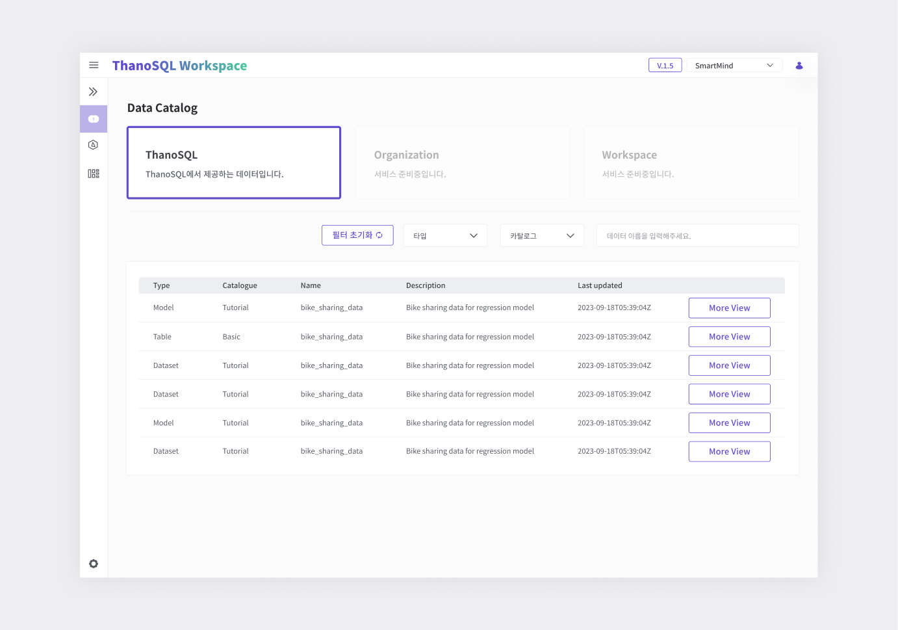
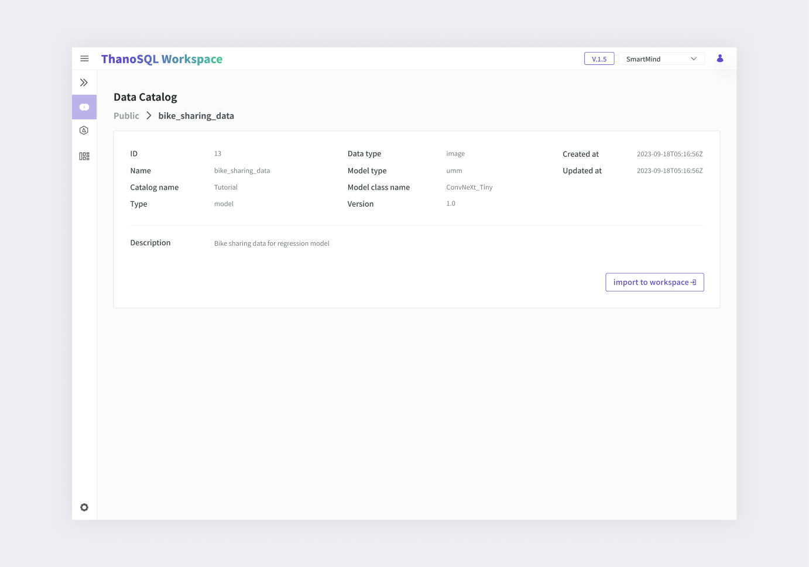

# **Data Catalog 매뉴얼**

Data Catalog는 ThanoSQL에서 사용할 수 있는 Dataset, Model, Table 등의 데이터들을 조회/관리 할 수 있습니다.
## **Data Catalog 페이지 개요**

데이터 카탈로그 그룹별로 카탈로그를 조회할 수 있습니다. 카탈로그 그룹을 선택하고, 필터를 이용해 원하는 데이터만 검색할 수 있습니다.

[{: style="max-height:none"}](../../../img/getting_started/paas/workspace/dc_img_1.png)

- 데이터 카탈로그 그룹

  - Public : ThanoSQL에서 기본으로 제공하는 카탈로그 그룹

  - Organization : Workspace 조직 단위로 데이터를 관리할 수 있는 그룹

  - Workspace : 유저 워크스페이스의 데이터 카탈로그 그룹

    *Organization, Workspace는 서비스 준비중입니다.*

- 필터 : 카탈로그 타입과 카탈로그 이름, 데이터 이름으로 검색 및 필터링 가능합니다.

- 상세 보기 : 각 데이터의 자세한 정보를 볼 수 있습니다. 

### **데이터 상세페이지**   

해당 데이터의 자세한 정보와 'Import to Workspace'로 사용자의 워크스페이스로 가져오는 기능을 제공합니다.

[{: style="max-height:none"}](../../../img/getting_started/paas/workspace/dc_img_2.png)

