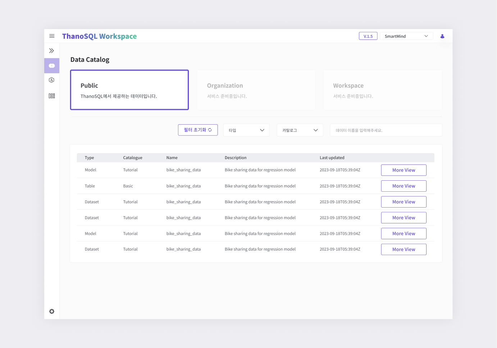

# **Data Catalog 매뉴얼**

Data Catalog는 ThanoSQL에서 사용할 수 있는 Dataset, Model, Table 등의 데이터들을 조회/관리 할 수 있습니다.

- Public : ThanoSQL에서 기본으로 제공하는 카탈로그 그룹

- Organization : Workspace 조직 단위로 리소스를 관리할 수 있는 공간

- Private : 유저가 개인적으로 리소스를 관리할 수 있는 공간

  *Organization, Workspace는 서비스 준비중입니다. 

## **Data Catalog 페이지 개요**

데이터 카탈로그 그룹 선택 영역을 클릭하고 원하는 리소스의 정보를 얻을 수 있으며, 다운 받을 수 있습니다.  (현재 Public만 서비스 운영중입니다.)

### **1-1) Public**

[{: style="max-height:none"}](../../../img/getting_started/paas/workspace/dc_img_1.png)

- 데이터 카탈로그 그룹 : 카탈로그 그룹을 선택해 원하는 서비스를 이용할 수 있습니다. 

- 필터 : 원하는 데이터를 필터를 이용해 찾을 수 있습니다. 타입, 카탈로그로 찾을 수 있고, 데이터 이름을 검색해 찾을 수 있습니다.  

- 상세 보기 : 데이터의 자세한 상세 정보를 볼 수 있습니다. 

### **1-2) Public 데이터 상세페이지**

해당 데이터의 자세한 정보와 'Import to Workspace'로 사용자의 워크스페이스로 가져오는 기능을 제공합니다.

[{: style="max-height:none"}](../../../img/getting_started/paas/workspace/qm_img_2.png)

