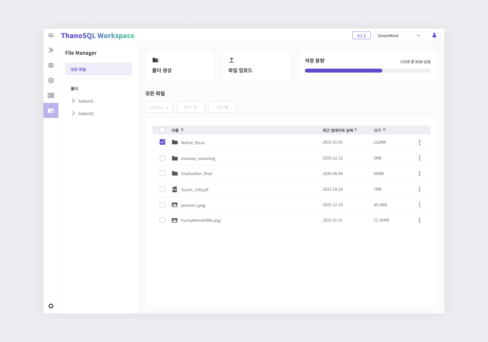

# **File Manager 매뉴얼**

File Manager는 Workspace 저장 공간에 파일을 업로드하고 관리할 수 있는 기능을 제공합니다. 사용자는 파일과 폴더를 생성, 이동, 복사, 삭제할 수 있습니다. 또한 저장 용량 및 파일의 속성을 확인 할 수 있어 효율적인 파일 관리가 가능합니다.

!!! note “” 루트(root) 디렉토리는 Lab과 동일합니다.

[{: style="max-height:none"}](../../../img/getting_started/paas/workspace/fm_img_1.png)

