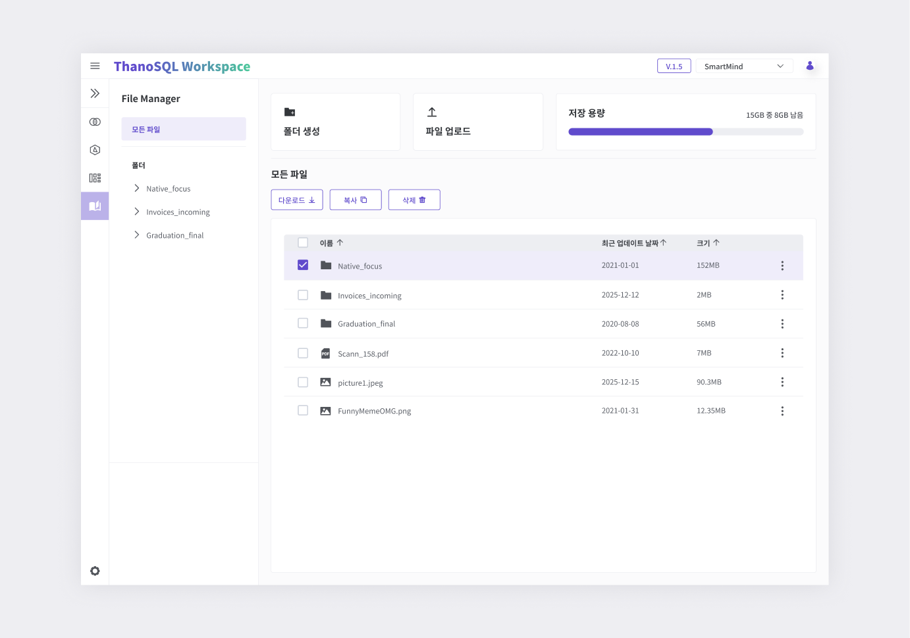

# **File Manager 매뉴얼**

File Manager는 Workspace에 파일을 업로드하고 관리할 수 있는 기능을 제공합니다.
Workspace 내 앱 사용시, 필요한 파일을 즉시 사용할 수 있습니다.

**루트 폴더는 Lab과 동일합니다.**

[{: style="max-height:none"}](../../../img/getting_started/paas/workspace/fm_img_1.png)

- 폴더 생성 : 폴더를 생성합니다.

- 파일 업로드 : 다양한 형식의 파일을 업로드 합니다.

- 저장 용량 : 현재 사용 중인 저장 공간과 남은 용량을 확인합니다.

