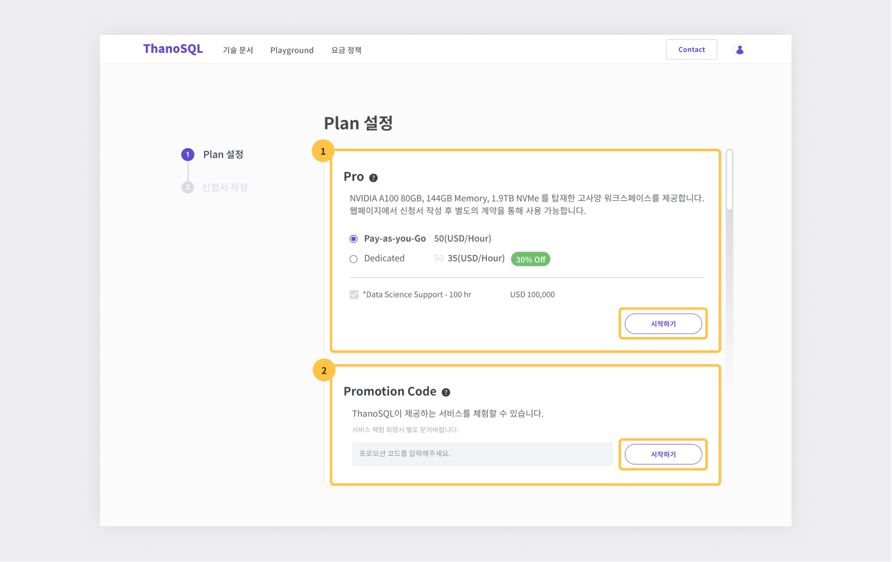
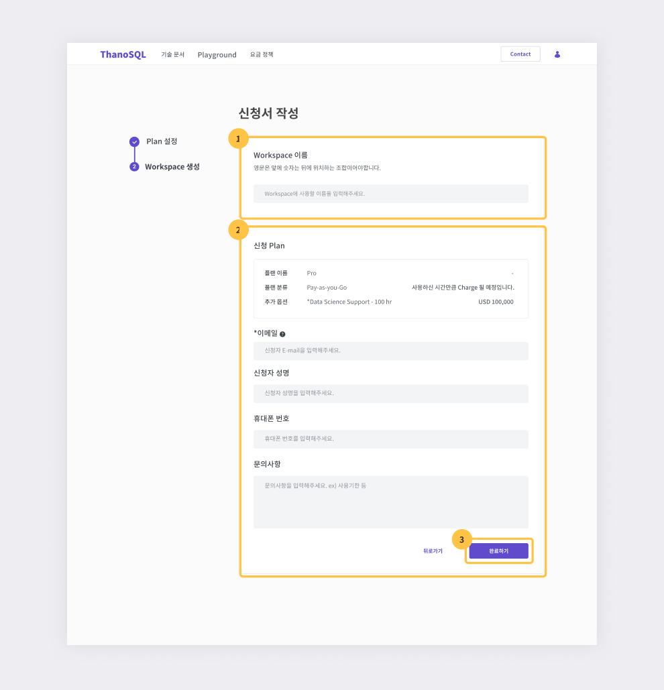
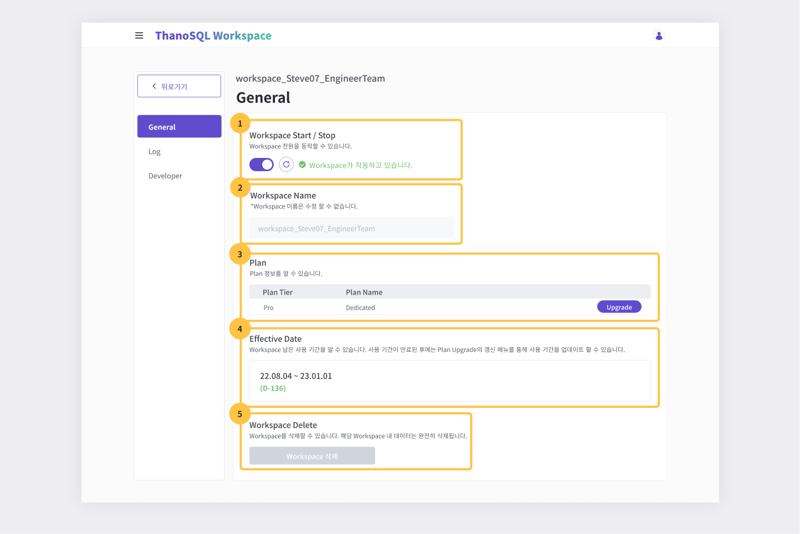
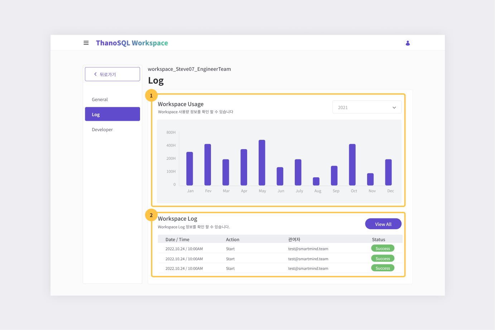
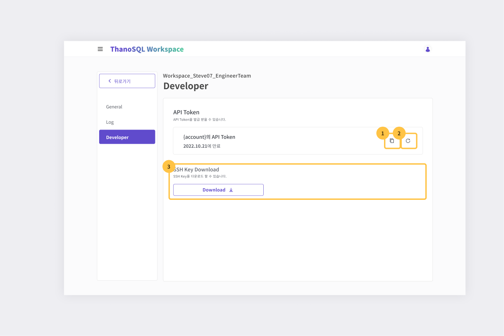

# __워크스페이스 둘러보기__

워크스페이스는 ThanoSQL로 데이터 처리, AI/ML 모델링 및 응용 프로그램 개발을 가능하게 하는 PaaS(Platform as a Service) 제품입니다. SQL의 강력함과 Jupyter 노트북의 다양성을 활용하여 데이터를 효율적으로 쿼리하고 분석할 수 있습니다.

워크스페이스는 크게 **메인 페이지**과 **서비스 페이지**으로 구성되어 있습니다.

- **메인 페이지** : 워크스페이스 생성, 조회 및 관리
- **서비스 페이지** : Query Manager와 Lab 등의 다양한 서비스 사용

## __메인 페이지__

워크스페이스 목록을 확인하고 관리 할 수 있습니다. 보유한 워크스페이스가 없을 경우 **시작하기 버튼**으로 워크스페이스를 새로 만들 수 있습니다. [워크스페이스 생성하기](#_4) 가이드를 참고하세요.

[{: style="max-height:none"}](../../../img/getting_started/img6.png)

① 워크스페이스 생성하기

- 워크스페이스 생성 화면으로 이동합니다.

② 워크스페이스

- 2-1 해당 워크스페이스의 이름을 확인 할 수 있습니다.
- 2-2. 해당 워크스페이스의 작동 여부를 확인 할 수 있습니다.
- 2-3. 해당 워크스페이스를 설정 할 수 있습니다.
- 2-4. 해당 워크스페이스의 Plan(이름, 분류), End Date, Role를 확인할 수 있습니다.
- 2-5. 해당 워크스페이스의 서비스 페이지로 이동합니다.

## __서비스 페이지__

메인 페이지의 워크스페이스 목록에서 접속하고자 하는 워크스페이스의 **열기 버튼**을 눌러 해당 워크스페이스의 서비스 페이지으로 이동가능합니다.

다음은 서비스 페이지에서 사용 가능한 기능입니다.

- **Query Manager** : ThanoSQL 쿼리를 실행하고 추적하는데 도움이 되는 도구입니다. 쿼리 편집기, 쿼리 로그 및 데이터 뷰어 등의 인터페이스를 제공합니다. 사용해 보려면 [Query Manager 매뉴얼](./query_manager.md)를 참조하세요.

- **Lab** : Jupyter Notebook을 기반으로 데이터 탐색, AI/ML 모델링 및 응용 프로그램 개발을 위한 다목적 환경을 제공합니다. 사용해 보려면 [Lab 매뉴얼](./lab.md)를 참조하세요.

[{: style="max-height:none"}](../../../img/getting_started/paas/workspace/img0.png)

서비스 페이지의 공통 컴포넌트인 사이드 내비(①)에서는 각 기능으로의 화면 이동과 해당 [워크스페이스 설정 화면](#_5) 바로가기를 제공합니다. 또한 우측 상단의 드롭박스 메뉴(②)로 다른 워크스페이스 서비스 페이지로 이동 할 수 있습니다.
## __워크스페이스 생성하기__

- 메인 페이지에서 Workspace 추가 생성하기 버튼을 클릭합니다.
- 기존 워크스페이스가 **없는** 경우 초기 메인 페이지에서 **시작하기 버튼**을 클릭해 워크스페이스를 생성 화면으로 이동합니다.

[{: style="max-height:none"}](../../../img/getting_started/img3.png)

### __1. 플랜 설정__

[{: style="max-height:none"}](../../../img/getting_started/img4.png)

① **플랜**

- 원하는 플랜을 선택합니다.
- 시작하기 버튼을 클릭해 다음 단계로 넘어갑니다.

② **프로모션 코드**

- 프로모션 코드를 입력합니다.

!!! warning
    프로모션 코드는 일회용입니다. 재사용 할 수 없습니다.

- 입력 후, 시작하기 버튼을 클릭해 다음 단계로 넘어갑니다.

### __2. 신청서 작성__

[{: style="max-height:none"}](../../../img/getting_started/img5.png)

① 워크스페이스 이름을 **입력**합니다.

- 워크스페이스 이름을 중복으로 사용할 수 없습니다.
- 워크스페이스 이름은 **영문(앞자리,소문자)**과 **숫자(뒷자리)**로만 작성 가능합니다. ex)myworkspace123

② 신청 Plan

1. 신청 Plan
      - 신청한 티어, 플랜 분류, 요금제 가격을 확인합니다.
2. 이메일
      - 연락 받을 이메일을 입력합니다.
      - **필수 입력 사항 입니다.**
3. 신청자 성명
      - 신청자의 성명을 입력합니다.
4. 휴대폰 번호
      - 신청자의 휴대폰 번호를 입력합니다.
5. 문의사항
      - 문의사항을 입력해주세요
!!! tip ""
      워크스페이스 사용기한 등 추가 요청 사항을 입력해주세요.

③ 신청 완료

- **완료하기 버튼**을 클릭해 워크스페이스 생성을 요청 / 완료합니다.

## __워크스페이스 설정 화면__

워크스페이스 일반적인 정보 확인, 사용량 로그 확인, API Token 등의 개발에 필요한 데이터를 다운 받을 수 있습니다. 메인 페이지의 워크스페이스 목록 설정 아이콘 혹은 서비스 페이지 좌측 하단의 설정 아이콘으로 화면 이동가능합니다.

### __General__

[{: style="max-height:none"}](../../../img/getting_started/img10.png)

① Workspace Start / Stop

- 워크스페이스를 실행/중지 할 수 있고, 상태를 알 수 있습니다. 

② Workspace Name

- 워크스페이스 이름을 확인할 수 있으나, 수정 할 수는 없습니다.

③ Plan

- Plan Tier, Plan Name을 확인할 수 있습니다.
- Upgrade 버튼을 통해 요금제 업그레이드 신청이 가능합니다.  

④ Effective Date

- 워크스페이스의 남은 사용 기간을 알 수 있습니다. 사용 기간이 만료된 후에는 ③의 Upgrade 버튼으로 사용 기간을 업데이트 요청할 수 있습니다.

⑤ Workspace Delete

- 요청 시, 워크스페이스를 삭제할 수 있습니다. 해당 워크스페이스 내 데이터는 완전히 삭제됩니다.  

!!! warning
      워크스페이스 삭제가 필요할 시 문의하기 페이지로 이동해 삭제 요청을 할 수 있습니다. 삭제 문의가 완료되면 해당 워크스페이스의 데이터는 완전히 삭제됩니다. 삭제된 데이터는 복구할 수 없습니다.

### __Log__

[{: style="max-height:none"}](../../../img/getting_started/img11.png)

① Workspace Usage

- 워크스페이스 사용 시간을 그래프로 확인할 수 있습니다.

② Workspace Log

- 해당 워크스페이스의 최신 로그를 바로 확인할 수 있습니다. **View All 버튼**을 누르면 모든 로그를 확인할 수 있는 페이지로 이동합니다.

### __Developer__

[{: style="max-height:none"}](../../../img/getting_started/img12.png)

① API 토큰 복사

- 해당 서비스를 이용하기 위해서는 API 토큰을 사용해야 합니다. API 토큰 복사 버튼을 누르면 클립보드에 복사됩니다. 

② API 토큰 재발급

- API 토큰은 새롭게 발급은 가능하나 이전에 발급받은 토큰은 더 이상 사용할 수 없습니다. API 토큰 재발급 요청 후 API 토큰을 복사 받으면 새로운 토큰을 받을 수 있습니다.

③ SSH Key Download

- SSH 키를 key.pem 파일로 다운로드 받을 수 있습니다.
