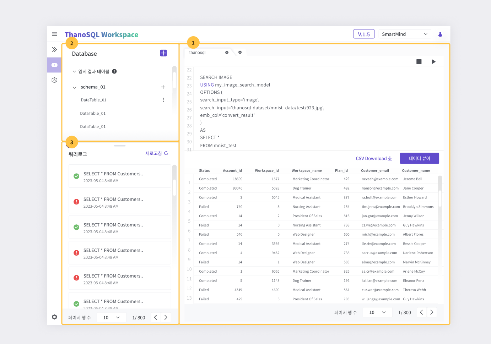
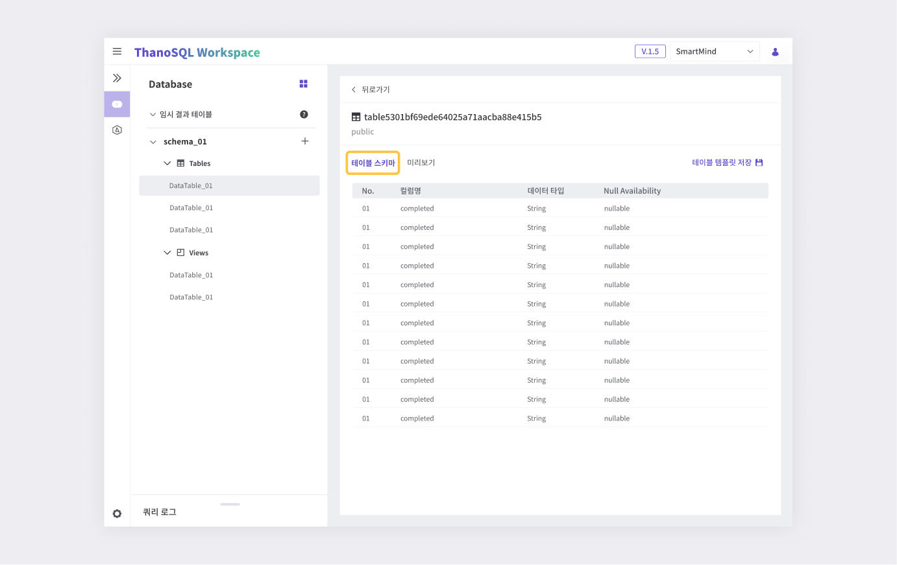
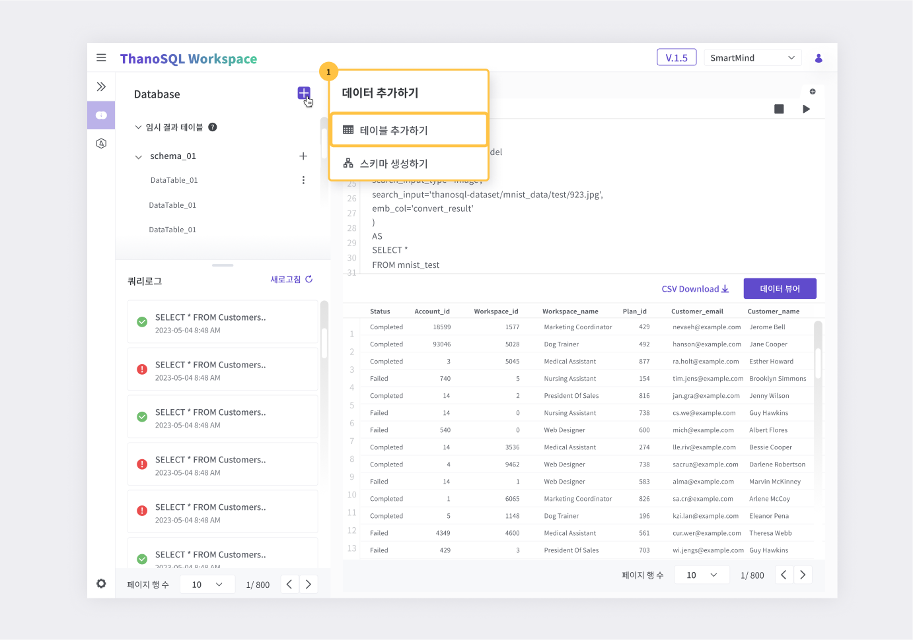
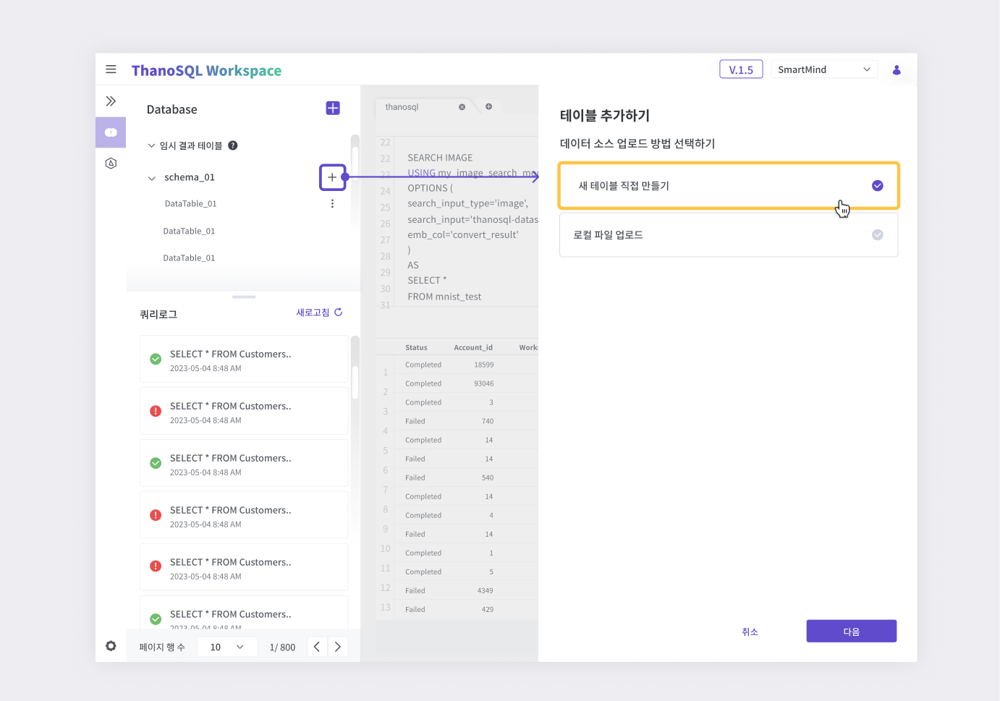
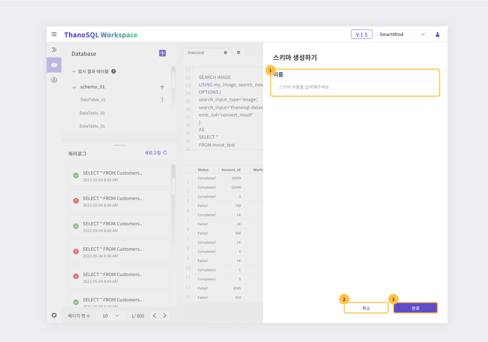

# **Query Manager 매뉴얼**

Query Manager는 DBMS와 유사한 친숙한 UI로 ThanoSQL 쿼리를 실행하고 결과를 분석할 수 있습니다. 워크스페이스 DB의 스키마 및 테이블 구조를 쉽게 파악할 수 있으며, 쿼리 로그로 이전 쿼리 결과들을 쉽게 다룰 수 있습니다. 또한 쿼리 실행 결과의 데이터 뷰어로 이미지, 비디오 등의 비정형 데이터를 분석합니다.

**주요 기능**

- ThanoSQL 및 기본 SQL 명령 실행
- 데이터 테이블의 '테이블 스키마' / '미리보기'
- 쿼리 로그
- 데이터 뷰어

## **Query Manager 페이지 개요**

Query Manager 페이지에는 세 가지 주요 섹션이 있습니다.

[{: style="max-height:none"}](../../../img/getting_started/paas/workspace/qm_img_1.png)

① 쿼리 에디터

② 데이터베이스 탐색기

③ 쿼리 로그

### **쿼리 에디터**

ThanoSQL 쿼리를 실행하고 결과를 테이블로 확인합니다.

[{: style="max-height:none"}](../../../img/getting_started/paas/workspace/qm_img_2.png)

① 탭 : 탭별로 쿼리문을 작성하고 결과를 볼 수 있습니다. 탭 추가 / 삭제가 가능합니다.

② 쿼리 입력 창 : 쿼리문을 입력하고 실행/중지합니다. [단축키](#_3)를 지원합니다.

③ CSV 다운로드 : 결과 테이블을 CSV로 다운로드 받을 수 있습니다.

④ [데이터 뷰어](#_2) : 이미지, 비디와 같은 비정형 데이터 분석에 사용합니다.

⑤ 결과 테이블 : 쿼리 결과를 테이블 형태로 출력합니다.

#### **데이터 뷰어**

쿼리 결과 테이블 내의 비정형 데이터를 확인할 수 있습니다. 비정형 파일의 경로가 저장된 컬럼을 선택 후 파일 형식(이미지, 비디오, 오디오)을 선택하여 비정형 데이터를 표시합니다. 데이터 뷰어 하단에는 페이지 이동 기능이 제공되어 한 번에 표시되는 데이터의 개수를 조절할 수 있습니다.

!!! tip
데이터 뷰어는 파일 경로를 기반으로 비정형 데이터를 표시합니다. 따라서 저장된 경로 값이 해당 워크스페이스에 실제로 존재해야 합니다. (간혹 프록시 등의 문제로 보이지 않을 수도 있습니다.)

#### **단축키**

쿼리 에디터에서 지원되는 단축키는 다음과 같습니다.

| 작업                                       | 키 조합(Windows/Linux) | 키 조합(Mac OS)    |
| ------------------------------------------ | ---------------------- | ------------------ |
| 현재 쿼리 또는 선택된 쿼리를 실행합니다    | Ctrl+Enter             | Cmd + Enter        |
| 현재 단어를 자동 완성합니다                | Tab or Ctrl + Space    | Tab or Cmd + Space |
| 현재 줄 또는 선택한 줄에 주석을 추가합니다 | Ctrl+/                 | Cmd + /            |
| 편집기 메뉴를 확인할 수 있습니다           | Shift + F10            | Shift + F10        |
| 편집기의 단축기 목록을 확인할 수 있습니다  | F1                     | F1                 |

!!! tip
쿼리 에디터는 VSCode에 사용되는 Monaco Editor를 사용하고 있습니다. 대부분의 단축키는 VSCode를 사용하는 방법과 동일합니다. Monaco Editor의 단축키 리스트는 [링크](https://en.docs.monaca.io/products_guide/monaca_ide/editor)를 참고하세요.

### **데이터베이스 탐색기**

워크스페이스 DB의 스키마 및 테이블 구성 정보를 확인할 수 있습니다. 각 워크스페이스는 public과 임시 결과 테이블을 기본적으로 제공하며, 스키마를 명시하지 않은 모든 쿼리들은 public의 테이블을 참조합니다. 쿼리 에디터에서 실행한 쿼리 중 그 결과가 테이블 형태로 있는 모든 쿼리들은 임시 결과 테이블에 임의의 테이블 이름으로 저장됩니다. 이를 이용하여 이전 테이블 실행 결과들을 언제든지 재사용할 수 있습니다.

#### **테이블 정보**

데이터베이스 탐색기는 스키마 내의 테이블에 대한 정보를 제공합니다. 테이블명을 클릭하면 다음의 정보를 확인할 수 있습니다.

**테이블 스키마**

해당 데이터 테이블의 컬럼명, 데이터 타입, Null 가능 여부를 확인할 수 있습니다.

[{: style="max-height:none"}](../../../img/getting_started/paas/workspace/qm_img_14.png)

**미리보기**

해당 데이터 테이블의 내용을 빠르게 파악할 수 있습니다.

!!! warning
미리보기에서는 데이터 테이블 편집이 불가능합니다.

[{: style="max-height:none"}](../../../img/getting_started/paas/workspace/qm_img_15.png)

#### **데이터 추가하기**

새로운 테이블과 스키마를 데이터베이스에 추가할 수 있는 기능입니다.

##### **테이블 추가하기**

데이터베이스 탐색기의 Database 우측에 위치한 **`+`** 버튼을 클릭해 테이블 데이터 추가하기 메뉴를 열고 테이블 추가하기를 클릭합니다.

[{: style="max-height:none"}](../../../img/getting_started/paas/workspace/qm_img_3.png)

**새 테이블 직접 만들기**

테이블 추가하기 창에서 새 테이블 직접 만들기를 선택한 후 다음 버튼을 클릭합니다.

[{: style="max-height:none"}](../../../img/getting_started/paas/workspace/qm_img_4.png)

스키마 우측 + 버튼으로도 데이터를 추가할 수 있습니다.

[{: style="max-height:none"}](../../../img/getting_started/paas/workspace/qm_img_5.png)

[{: style="max-height:none"}](../../../img/getting_started/paas/workspace/qm_img_6.png)

① 스키마 선택 : 테이블을 생성할 스키마를 선택할 수 있습니다.

② 스키마 생성 : 스키마를 새로 생성합니다.

③ 이름 : 생성하려는 테이블의 이름을 작성할 수 있습니다. 테이블 이름은 문자, 숫자, 언더스코어를 포함할 수 있으며 숫자로 시작할 수 없습니다. 같은 스키마 안에서는 중복된 이름의 테이블을 생성할 수 없습니다.

④ Name(이름) : 해당 컬럼 이름을 작성할 수 있습니다. 필수로 입력해야 하며 같은 테이블 안에서는 중복된 이름의 컬럼을 생성할 수 없습니다.

⑤ Data Type(데이터 타입) : 해당 컬럼의 데이터 타입을 선택할 수 있습니다. 필수로 입력해야 합니다.

⑥ 컬럼 옵션 : Data Type(데이터 타입)에 따라 조정할 수 있는 옵션이 달라지고, 해당 컬럼의 용도에 맞게 설정할 수 있습니다.

⑦ 컬럼 삭제 버튼 : 해당 컬럼을 삭제할 수 있습니다.

⑧ 컬럼 추가 버튼 : 새로운 컬럼을 추가할 수 있습니다.

⑨ 취소 버튼 : 새 테이블 직접 만들기를 취소할 수 있습니다.

⑩ 완료 버튼 : 새 테이블 직접 만들기를 완료할 수 있습니다.

**로컬 파일 업로드로 테이블 추가하기**

테이블 추가하기 창에서 로컬 파일 업로드를 선택한 후 다음 버튼을 클릭합니다.

[{: style="max-height:none"}](../../../img/getting_started/paas/workspace/qm_img_7.png)

[{: style="max-height:none"}](../../../img/getting_started/paas/workspace/qm_img_8.png)

① 파일 형식 선택 : CSV, Excel을 선택할 수 있습니다. CSV 선택 시, (.csv 파일)만 업로드할 수 있고, Excel 선택 시, (.xls, .xlsx, .xlsm, .xlsb, .odf, .ods, .odt 파일)만 업로드 할 수 있습니다.

② 파일 업로드 : 해당 파일 형식 선택 후, 형식에 맞는 파일을 업로드할 수 있습니다.

③ 스키마 선택 : 테이블을 생성할 스키마를 선택할 수 있습니다.

④ 스키마 생성 : 서비스를 처음 이용하거나 새로운 스키마를 생성하고 싶을 때 스키마 생성 버튼을 눌러 생성할 수 있습니다.

⑤ 이름 : 생성하려는 테이블의 이름을 작성할 수 있습니다. 테이블 이름은 문자, 숫자, 언더스코어를 포함할 수 있으며 숫자로 시작할 수 없습니다. 같은 스키마 안에서는 중복된 이름의 테이블을 생성할 수 없습니다.

⑥**컬럼 설정**

업로드한 파일을 자동감지할 수도 있고, 직접 입력할 수도 있습니다.

- 자동 감지 : 업로드한 파일의 컬럼을 자동 감지합니다.
- 직접 입력 : 컬럼을 직접 입력할 수 있습니다.

[{: style="max-height:none"}](../../../img/getting_started/paas/workspace/qm_img_9.png)

⑦ 옵션

- 데이터 쓰기 : 데이터 쓰기 옵션을 선택할 수 있습니다.

⑧ 취소 버튼 : 로컬 파일 업로드를 취소할 수 있습니다.

⑨ 완료 버튼 : 로컬 파일 업로드를 완료할 수 있습니다.

##### **스키마 생성하기**

스키마를 생성할 수 있습니다.

데이터베이스 탐색기의 Database 우측에 위치한 **`+`** 버튼을 클릭해 테이블 데이터 추가하기 메뉴를 열고 스키마 생성하기를 클릭합니다.

[{: style="max-height:none"}](../../../img/getting_started/paas/workspace/qm_img_9.png)

[{: style="max-height:none"}](../../../img/getting_started/paas/workspace/qm_img_12.png)

① 스키마 이름 : 생성하려는 스키마의 작성할 수 있습니다. 스키마 이름은 문자, 숫자, 언더스코어를 포함할 수 있으며 숫자로 시작할 수 없습니다. 같은 데이터베이스 안에서는 중복된 이름의 스키마를 생성할 수 없습니다.

② 취소 버튼 : 스키마 생성을 취소할 수 있습니다.

③ 완료 버튼 : 스키마 생성을 완료할 수 있습니다.

#### 테이블 삭제

[{: style="max-height:none"}](../../../img/getting_started/paas/workspace/qm_img_13.png)

### **쿼리 로그**

Query Manager에서 실행한 모든 쿼리는 기록되어 쿼리 로그 섹션에서 확인할 수 있습니다. 쿼리 생성시간의 최신순으로 나열되며 실행한 쿼리 구문과 쿼리의 성공 여부를 보여줍니다.

[{: style="max-height:none"}](../../../img/getting_started/paas/workspace/qm_img_16.png)

#### 상세 정보 창

쿼리 로그를 클릭하면 해당 쿼리의 상세 정보가 우측에 표시됩니다.

① 쿼리 정보 : 아이디, 성공 여부, 생성 시간, 실행 시간, 종료 시간, 대상 테이블 명을 표시합니다.

② 쿼리 구문 : 실행한 쿼리 구문이 표시됩니다.

③ 에러 메시지 : 쿼리 실행 시 발생한 에러 메시지를 표시합니다.

④ 새 쿼리로 열기 : 해당 쿼리의 내용으로 쿼리 에디터 탭을 엽니다.
