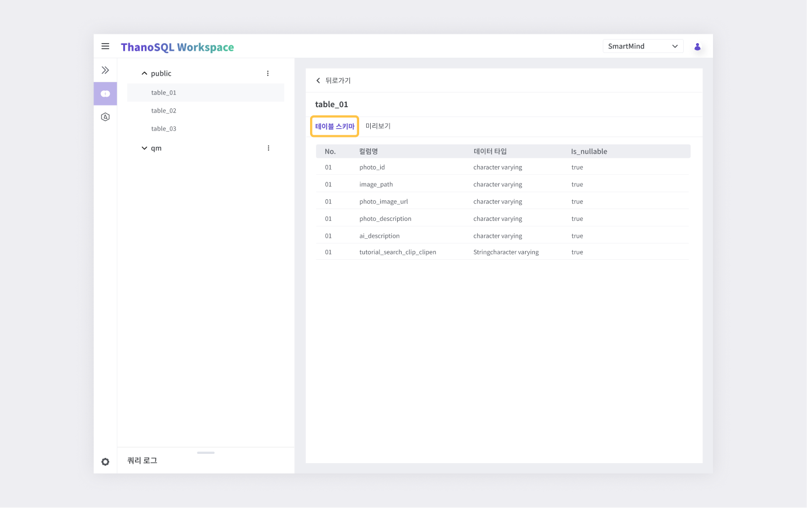
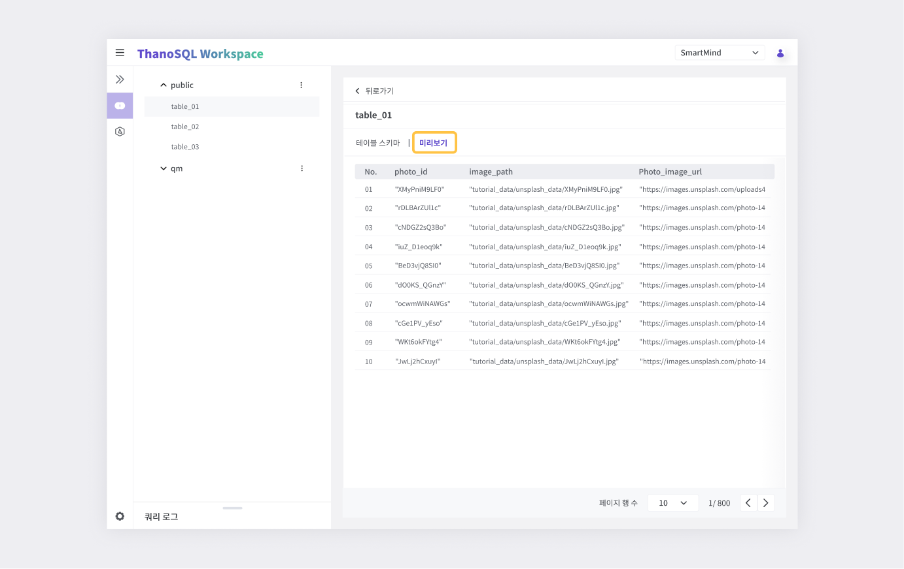

# __Query Manager 매뉴얼__

Query Manager는 DBMS와 유사한 친숙한 UI로 ThanoSQL 쿼리를 실행하고 결과를 분석할 수 있습니다. 워크스페이스 DB의 스키마 및 테이블 구조를 쉽게 파악 할 수 있으며, 쿼리 로그로 이전 쿼리 결과들을 쉽게 다룰 수 있습니다. 또한 쿼리 실행 결과의 데이터 뷰어로 이미지, 비디오 등의 비정형 데이터를 분석합니다.

**주요 기능**

- ThanoSQL 및 기본 SQL 명령 실행
- 데이터 테이블의 '테이블 스키마' / '미리보기'
- 쿼리 로그
- 데이터 뷰어

## __Query Manager 페이지 개요__

Query Manager 페이지에는 세 가지 주요 섹션이 있습니다.

[{: style="max-height:none"}](../../../img/getting_started/paas/workspace/qm_img_0.png)

① 쿼리 에디터

② 데이터베이스 탐색기

③ 쿼리 로그

### __쿼리 에디터__

ThanoSQL 쿼리를 실행하고 결과를 테이블로 확인합니다.

[{: style="max-height:none"}](../../../img/getting_started/paas/workspace/qm_img_1.png)

① 탭 : 탭 별로 쿼리문을 작성하고 결과를 볼 수 있습니다. 탭 추가 / 삭제가 가능합니다.

② 쿼리 입력 창 : 쿼리문을 입력하고 실행/중지 합니다. [단축키](#_3)를 지원합니다.

③ CSV 다운로드 : 결과 테이블을 CSV로 다운로드 받을 수 있습니다.

④ [데이터 뷰어](#_2) : 이미지, 비디와 같은 비정형 데이터 분석에 사용합니다.

⑤ 결과 테이블 : 쿼리 결과를 테이블 형태로 출력합니다.

#### 데이터 뷰어

쿼리 결과 테이블 내의 비정형 데이터를 확인할 수 있습니다. 비정형 파일의 경로가 저장된 컬럼을 선택 후 파일 형식(이미지, 비디오, 오디오)을 선택하여 비정형 데이터를 표시합니다. 하단의 페이지 이동 기능으로 한 번에 표시할 개수를 조절하고 다른 페이지로 이동할 수 있습니다.

!!! warning
    데이터 뷰어는 파일 경로를 기반으로 비정형 데이터를 표시합니다. 따라서 저장된 경로 값이 해당 워크스페이스에 실제로 존재해야 합니다. (간혹 프록시 등의 문제로 보이지 않을 수도 있습니다)

#### 단축키

쿼리 에디터에서 지원되는 단축키는 다음과 같습니다.

| 작업 | 키 조합(Windows/Linux) | 키 조합(Mac OS) |
| -- | -- | -- |
| 현재 쿼리 또는 선택된 쿼리를 실행합니다 | Ctrl+Enter | Cmd + Enter |
| 현재 단어를 자동 완성합니다 | Tab or Ctrl + Space | Tab or Cmd + Space |
| 현재 줄 또는 선택한 줄에 주석을 추가합니다 | Ctrl+/ | Cmd + / |
| 편집기 메뉴를 확인 할 수 있습니다 | Shift + F10 | Shift + F10 |
| 편집기의 단축기 목록을 확인 할 수 있습니다 | F1 | F1 |

!!! tip
    쿼리 에디터는 VSCode에 사용되는 Monaco Editor를 사용하고 있습니다. 대부분의 단축키는 VSCode를 사용하는 방법과 동일합니다. Monaco Editor의 단축키 리스트는 [링크](https://en.docs.monaca.io/products_guide/monaca_ide/editor)를 참고하세요.

### __데이터베이스 탐색기__

워크스페이스 DB의 [스키마](https://www.postgresql.org/docs/current/ddl-schemas.html) 및 테이블 구성 정보를 확인 할 수 있습니다. 각 워크스페이스는 `public`과 `qm` 스키마를 기본적으로 제공하며, 스키마를 명시하지 않은 모든 쿼리들은 `public`의 테이블을 참조합니다. 쿼리 에디터에서 실행한 쿼리 중 그 결과가 테이블 형태로 있는 모든 쿼리들은 `qm` 스키마에 임의의 테이블 이름으로 저장됩니다. 이를 이용하여 이전 테이블 실행 결과들을 언제든지 재사용할 수 있습니다.

!!! warning
    `qm` 스키마의 쿼리 결과 임시 테이블은 최대 7일 동안만 유지됩니다.

#### **테이블 정보**

데이터베이스 탐색기는 스키마 내의 테이블에 대한 정보를 제공합니다. 테이블명을 클릭하면 다음의 정보를 확인 할 수 있습니다.

**테이블 스키마**

해당 데이터 테이블의 컬럼명, 데이터 타입, Null 가능 여부를 확인 할 수 있습니다.

[{: style="max-height:none"}](../../../img/getting_started/paas/workspace/img3.png)

**미리보기**

해당 데이터 테이블의 내용을 빠르게 파악할 수 있습니다.

!!! warning 
    미리보기에서는 데이터 테이블 편집이 불가능합니다.

[{: style="max-height:none"}](../../../img/getting_started/paas/workspace/img4.png)

### __쿼리 로그__

Query Manager에서 실행한 모든 쿼리는 기록되어 쿼리 로그 섹션에서 확인할 수 있습니다. 쿼리 생성시간의 최신순으로 나열되며 실행한 쿼리 구문과 쿼리의 성공 여부를 보여줍니다.

[{: style="max-height:none"}](../../../img/getting_started/paas/workspace/qm_img_2.png)

#### 상세 정보 창

쿼리 로그를 클릭하면 해당 쿼리의 상세 정보가 우측에 표시됩니다.

① 쿼리 정보 : 아이디, 성공 여부, 생성 시간, 실행 시간, 종료 시간, 대상 테이블 명을 표시합니다.

② 쿼리 구문 : 실행한 쿼리 구문이 표시됩니다.

③ 에러 메세지 : 쿼리 실행 시 발생한 에러 메세지를 표시합니다.

④ 새 쿼리로 열기 : 해당 쿼리의 내용으로 쿼리 에디터 탭을 엽니다.
