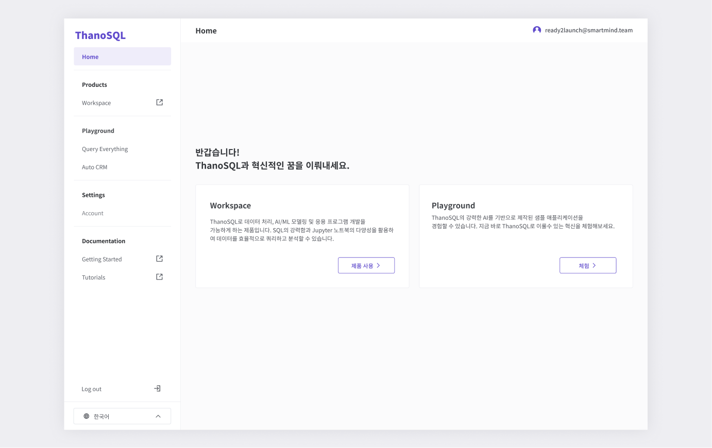

# __ThanoSQL 웹 사용법__

## __1. [ThanoSQL Web](https://www.thanosql.ai/){style="color:#604bcc" target="_blank"} 접속하기__

ThanoSQL에 접속 후, **Console 버튼(또는 메인화면의 시작하기 버튼)**을 클릭해 로그인 화면으로 접속합니다.

[{: style="max-height:none"}](../img/getting_started/img1.png)

!!! note ""
      ThanoSQL 콘솔을 사용 하기 위해서는 필수로 회원가입을 진행해야 합니다.

## __2. 회원가입__

[{: style="max-height:none"}](../img/getting_started/img2_0.png)

ThanoSQL 로그인 화면에서 **회원가입 하기 버튼**을 클릭합니다.

 

[{: style="max-height:none"}](../img/getting_started/img2_1.png)

- 정보입력 후 **계정 만들기 버튼**을 클릭해 회원가입을 완료합니다.
- **이메일 인증**, **서비스 이용약관**과 **개인정보처리방침**에 동의 후 가입 할 수 있습니다.

 

[{: style="max-height:none"}](../img/getting_started/img2_2.png)

- 가입 후, Console 페이지로 이동합니다.(Console 페이지는 로그인 또는 회원가입 후 사용 가능합니다.)
- 원하는 제품을 선택해 사용이 가능하며, playground에서 ThanoSQL의 강력한 AI를 기반으로 제작된 Sample Application을 경험할 수 있습니다.
- setting -> Account 페이지에서 계정 관리를 할 수 있습니다.  
- 로그아웃 버튼을 클릭해 안전하게 로그아웃 할 수 있습니다. 
