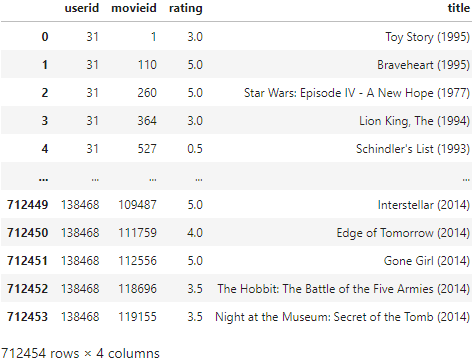
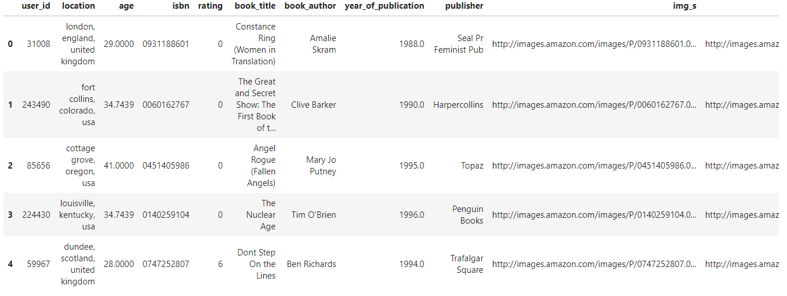

# **ThanoSQL LightFM Recommender System** 
## **Tutorial Guideline :** 
This tutorial introduces the LightFM recommendation system for data analysts. The goal of this tutorial is letting data analysts, who use SQL for getting some insights from a dataset, be able to build predictive machine learning models.

With ThanoSQL, you can build machine learning models and excecute them by using standard SQL query. Our goal is letting SQL practitioners build ML models by using simple SQL queries. Therefore, they do not need to have extensive programming skills and knowledge of machine learning to create ML models. ThanoSQL popularizes the use of machine learning and increases development speed by eliminating the need to move data.   

In this tutorial, you learn how to create a LightFM recommender model that utilizes explicit-feedback using Kaggle's Movielens and Goodbooks datasets to create a recommendation list based on item IDs and user IDs.  

The Movielens dataset contains the rating from a scale of 1 to 5 that user gave to movies, along with metadata of the movie such as genre and title.
The Goodbooks dataset contains the rating from a scale of 1 to 10 that user gave to books, along with metadata of the book such as genre, title.

<br>

## **Model Description :**
    - Model Description: The LightFM model is a hybrid model that combines the Content-based filtering and Collaborative filtering. The model is proposed by an ecommerce company, Lyst to minimize the cold-start problem of the recommendation system. All items and users in the metadata are embedded into latent vectors by using matrix factorization. It represents each user and item as the sum of the latent representations of their features, thus allowing recommendations to generalise to new items (via item features) and to new users (via user features). The model learns embedding values with the method of Stochastic gradient descent. In this process, it uses four different loss functions to learn the embeddings. ThanoSQL uses WARP, which is generally perform well, as a loss function when there is no specific loss function selection.  


* logistic: a loss function that is useful when both positive (1) and negative (-1) interactions are present.

* BPR: Bayesian Personalised Ranking Pairwise loss. Maximises the prediction difference between a positive example and a randomly chosen negative example. Useful when only positive interactions are present and optimising ROC AUC is desired.

*  WARP: Weighted Approximate-Rank Pairwise loss. Maximises the rank of positive examples by repeatedly sampling negative examples until rank violating one is found. Useful when only positive interactions are present and optimising the top of the recommendation list (precision@k) is desired.

*  k-OS WARP: k-th Order Statistic loss. A modification of WARP that uses the k-th positive example for any given user as a basis for pairwise updates.

* For more details of parameters, https://making.lyst.com/lightfm/docs/lightfm.html

<br>

## **Intended uses & Limitation**
- ThanoSQL team customized LFM model for SQL practitioners to create a recommendation list by using simple SQL quries without any other kind of coding works.
- You can build a recommendation model if you have a table that contains columns of 'UserID', 'ItemID', 'Rating'.
- With thanoSQL, you can simply preprocess data for building a recommendation model without a deep knowledge of various programming languages such as Python, Java, or C and also a deep understanding of machine learning concepts.   
- SQL practitioners use a built model to create three different kinds of recommendation lists of 'User to Item', 'Item to User', 'Item to Item' by using the Predict function. 
- Because the LFM model uses the Matrix factorization algorithm, the larger data results the higher computation and overloading the computer. (If the size of the data exceeds a certain standard, it is recommended to seperate the table by time to create a recommendation model)

<br>
<br>

# **Build a rating based movie recommendation model and create movie recommendation lists**
## **How to upload a dataset to the ThanoSQL database**
Upload the movielens.csv file stored in a local environment to the ThanoSQL DB by using standard queries.
```postgresql
CREATE TABLE movielens_train 
(
    userid      int not null,
    movieid     int not null,
    rating      float not null,
    title       varchar(5000) not null
);
COPY movielens_train from '/your local data directory/movielens.csv' delimiter ',' csv header; 
```

<br>

## **How to check the uploaded dataset in the ThanoSQL DB**
Check the movielens sample dataset stored in the ThanoSQL database by using standard queries.
`movielens_train` contains columns of 'userid','movieid','rating', and 'title'. This dataset is stored in the ThanoSQL database, so you can simply load it through executing below sql quries.  
  
```POSTGRESQL
SELECT * FROM movielens_train
```


<br>

## **Build recommendation model**
In this step, you use the `movielens_train` dataset that you checked in previous step to create a movie recommendation model. You name columns for 'user_col', 'item_col', 'rating_col' from the sample dataset. If the dataset includes 'item_names', you can also name it for 'item_names'.   

```POSTGRESQL
BUILD MODEL movie_rec 
USING Light_FM 
OPTIONS (   user_col='userid', 
            item_col='movieid',
            rating_col='rating', 
            item_names= 'title'
        ) 
AS SELECT * FROM movielens_train
```
<br>

>### **Query Details**
> The ```BUILD MODEL``` clause is used to create and train the model named movie_rec.

>The ```OPTIONS(user_col='userid',item_col='movieid',rating_col='rating', item_names= 'title', ...)``` clause indicates that you are creating a model with values of columns, 'userid', 'movieid', 'rating' and 'title' from the sample dataset. You are able to tune hyperparameters in this option clause for the LFM model if you want to get the higher precision. By default, it will use general parameters for builing model. You can check more details of what parameters you can use via this link https://making.lyst.com/lightfm/docs/lightfm.html

<br>
<br>

## **Use your model to create a user to item recommendations**
You predict a personalized movie recommendation list for a specific user by using the model that you built in the previous step.  

```POSTGRESQL
PREDICT USING movie_rec 
OPTIONS (predict_type='predict_user', user_id=1, nrec=10) 
AS SELECT * FROM movielens_train 
```
<br>

>### **Query Details**
>The ```PREDICT USING``` clause let the 'movie_rec' model that you created before predict personal preferences of movies.
The ```OPTIONS(predict_type='predict_user', user_id=1, nrec=10, ...)``` clause indicates that you are going to predict a user to item recommendation list that contains 10 items(nrec=10) for a specific user whose user_id is 1 (user_id=1)

<br>
<br>

## **Use your model to create an item to user recommendations** 
Use your model that you built in previous step to create a user recommended list for an specific item.
```POSTGRESQL
PREDICT USING movie_rec 
OPTIONS (predict_type='predict_item', item_id=1, nrec=10) 
AS SELECT * FROM movielens_train 
```
<br>

>### **Query Details**
>The ```PREDICT USING``` clause let the 'movie_rec' model that you created before predict personal preferences of movies.
The ```OPTIONS(predict_type='predict_item', item_id=1, nrec=10, ...)``` clause indicates that you are going to predict an item to user recommendation list that contains 10 users(nrec=10) for an specific item which item_id is 1 (item_id=1). The result shows a list of 10 users who may like the movie which movie_id is 1.

<br>
<br>

## **Use your model to create an item to item recommendations**
Use your model to create an item recommendation that a list of items similar to the specific items you specify.
```POSTGRESQL
PREDICT USING movie_rec 
OPTIONS (predict_type='predict_simitem', item_id=1, nrec=10) 
AS SELECT * FROM movielens_train 
```
<br>

>### **Query Details**
>The ```PREDICT USING``` clause let the 'movie_rec' model that you created before predict personal preferences of movies.
The ```OPTIONS(predict_type='predict_simitem', item_id=1, nrec=10, ...)``` clause indicates that you are going to create an item to item recommendation list that contains 10 similar items(nrec=10) for an specific item which item_id is 1 (item_id=1). The result shows a list of 10 similar items to the specified item.

<br>
<br>

# **Practice building LFM recommend model with other dataset**
If you finished movielens tutorial, try Goodbooks sample dataset stored in the ThanoSQL DB to build LFM recommendation model that recommends books that users will like.  
 <br>
```POSTGRESQL
SELECT * FROM books_train LIMIT 5
```

>   user_col='user_id', <br>
    item_col='lsbn', <br>
    rating_col='rating', <br>
    item_names= 'book_title'<br>

