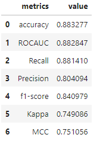
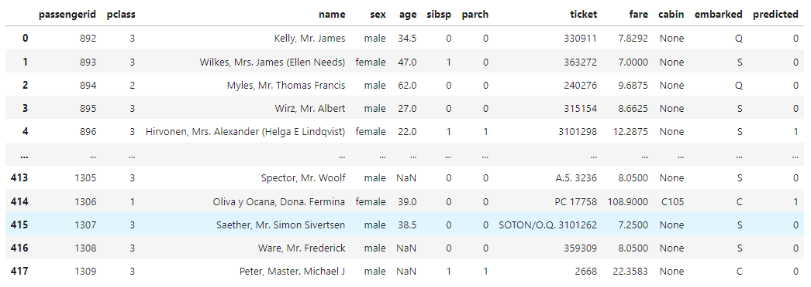

# ThanoSQL 무작정 따라하기
---
# ThanoSQL에서 자동화된 ML을 이용하여 캐글 타이타닉 생존자 분류 모델 만들기 
---

## 시작 전 사전정보
---
- 튜토리얼 난이도 ★☆☆☆☆
- 읽는 시간 : 4 분
- 사용 언어 : SQL (100%)
- 실행 파일 위치 : 
- 참고 문서 : [캐글 타이타닉 대회](https://www.kaggle.com/competitions/titanic/overview)


## 튜토리얼 소개
---
> __`분류 작업 이해하기`__ : 분류 작업은 목표로 하는 항목이 속한 범주를 예측하는 데 사용하는 기계 학습의 한 형태입니다.  <br>
예를 들면,  기업의 마케팅 프로모션에 대해 긍정적인 반응을 보일 것인지 아닐 것인지를 예측하기 위해서는 고객의 CRM 데이터
(인구 통계학 정보,  고객의 행동 데이터 그리고 고객의 검색 데이터 등)를 이용할 수 있습니다.   
이 경우 고객의 CRM 데이터에서 표현되는 특성이 특징이며, 범주는 프로모션에 대해 각각 긍정적일 것이거나 부정적일 것 같은 고객을 나타내는 0 또는 1이라는 분류입니다.   
이러한 분류 작업을 통해, 마케팅에 노출되지 않은 고객들의 프로모션에 대한 반응을 예측할 수 있습니다. 

아래는 ThanoSQL 분류 모델의 활용 및 예시입니다. 
- 분류 모델은 문제(사건)에 대해 즉각 대응할 수 있도록 현재 사용자의 이탈에 대한 조기 탐지를 가능하게 합니다. 과거 데이터를 통해 이탈 고객의 특성을 파악할 수 있게 되고 조기 탐지하고 조치하여 고객과의 관계 유지 강화 및 수익 감소 효과를 기대할 수 있습니다. 

- 온라인 플랫폼 내에서 사용자의 세그먼트를 예측할 수 있습니다. 대부분의 서비스 사용자들은 서로 다른 속성을 가지고 사고방식과 필요를 가지고 있습니다. 분류 예측 모델은 서비스 사용자의 특성을 이용하여 세분화된 집단을 식별하고 그들에게 맞춤화된 전략 수립을 가능하게 합니다.  


:point_right: 본 튜토리얼에서는 캐글 경진대회의 입문자를 위한 문제라고 할 수 있는 `Titanic: Machine Learning from Disaster` 데이터를 사용하여 생존자 예측 분류 모델을 만듭니다. 이 대회의 목표는 아래와 같습니다. 
(참고로, 해당 대회의 데이터는 1912년 4월 15일 실제 타이타닉 사건 때, 탑승했었던 승객들 명단입니다.)

> __타이타닉에서 살아남을 수 있는 승객을 예측하기__

ThanoSQL에서는 자동화된 ML을 제공합니다. 본 튜토리얼에서는 자동화된 ML을 사용하여 타이타닉에서 살아남을 수 있는 승객을 예측합니다. ThanoSQL에서 제공하는 자동화된 ML은 기계학습 모델 개발 프로세스를 보편화하고, 데이터 과학 전문 지식과 관계없이 문제에 대한 엔드투엔드 기계학습 파이프라인을 식별할 수 있도록 사용자의 역량을 강화시킵니다.

**자동화된 ML을 사용하면 다음과 같은 장점이 있습니다.** 

1. 광범위한 프로그래밍 지식 없이 ML 솔루션 구현 
2. 시간 및 리소스 절약 
3. 신속한 문제 해결 제공

그러면 이제 ThanoSQL을 사용하여 간단하게 타이타닉에서 살아남을 수 있는 승객을 예측하는 분류 모델을 만들어 보겠습니다.


## 1. 데이터 세트 확인
---
생존자 예측 분류 모델을 만들기 위해 우리는 우리는 ThanoSQL DB에 저장되어 있는 titanic_train을 사용합니다. 아래의 쿼리문을 실행하면서 테이블 내용을 확인합니다.

```python
%%thanosql
SELECT * 
FROM titanic_train 
LIMIT 5 
```
<div>
<table border=\1\ class=\dataframe\>
    <thead>
    <tr style=\text-align: right;\>
        <th></th>
        <th>passengerid</th>
        <th>survived</th>
        <th>pclass</th>
        <th>name</th>
        <th>sex</th>
        <th>age</th>
        <th>sibsp</th>
        <th>parch</th>
        <th>ticket</th>
        <th>fare</th>
        <th>cabin</th>
        <th>embarked</th>
    </tr>
    </thead>
    <tbody>
    <tr>
        <th>0</th>
        <td>1</td>
        <td>0</td>
        <td>3</td>
        <td>Braund, Mr. Owen Harris</td>
        <td>male</td>
        <td>22</td>
        <td>1</td>
        <td>0</td>
        <td>A/5 21171</td>
        <td>7.2500</td>
        <td>None</td>
        <td>S</td>
    </tr>
    <tr>
        <th>1</th>
        <td>2</td>
        <td>1</td>
        <td>1</td>
        <td>Cumings, Mrs. John Bradley (Florence Briggs Th...</td>
        <td>female</td>
        <td>38</td>
        <td>1</td>
        <td>0</td>
        <td>PC 17599</td>
        <td>71.2833</td>
        <td>C85</td>
        <td>C</td>
    </tr>
    <tr>
        <th>2</th>
        <td>3</td>
        <td>1</td>
        <td>3</td>
        <td>Heikkinen, Miss. Laina</td>
        <td>female</td>
        <td>26</td>
        <td>0</td>
        <td>0</td>
        <td>STON/O2. 3101282</td>
        <td>7.9250</td>
        <td>None</td>
        <td>S</td>
    </tr>
    <tr>
        <th>3</th>
        <td>4</td>
        <td>1</td>
        <td>1</td>
        <td>Futrelle, Mrs. Jacques Heath (Lily May Peel)</td>
        <td>female</td>
        <td>35</td>
        <td>1</td>
        <td>0</td>
        <td>113803</td>
        <td>53.1000</td>
        <td>C123</td>
        <td>S</td>
    </tr>
    <tr>
        <th>4</th>
        <td>5</td>
        <td>0</td>
        <td>3</td>
        <td>Allen, Mr. William Henry</td>
        <td>male</td>
        <td>35</td>
        <td>0</td>
        <td>0</td>
        <td>373450</td>
        <td>8.0500</td>
        <td>None</td>
        <td>S</td>
    </tr>
    </tbody>
</table>
</div>


> __데이터 이해하기__   
`tianic_train` 데이터 세트는 `passengerid`: 탑승승객 아이디, `survived`: 탑승승객, `pclass`: 탑승승객 티켓 등급, `name`: 탑승승객 이름, `sex`: 탑승승객 성별, `age`: 탑승승객 나이, `sibsp`: 탑승한 형제 자매/ 배우자 수, `parch`: 탑승한 부모/자녀의 수, `ticket`: 티켓 번호, `fare`: 요금, `cabin`: 선실, `embarked`: 승선지(항구) 에 대한 정보를 담고 있습니다. 이번 튜토리얼에서는 추가적인 전처리가 필요한 name, ticket, cabin을 제외하겠습니다. 

## 2. 분류 모델 빌드
---
이전 단계에서 확인한 `titanic_train` 데이터를 사용하여 생존자 예측 분류 모델을 만듭니다. 아래의 쿼리 구문을 실행시켜 'titanic_classification' 이름의 모델을 만들어 봅니다.


```python
%%thanosql
BUILD MODEL titanic_classification
USING AutomlClassifier 
OPTIONS (
    target='survived', 
    impute_type='iterative',  
    features_to_drop=["name", 'ticket', 'passengerid','cabin']
    ) 
AS 
(SELECT * 
FROM titanic_train)
```

> __쿼리 세부 정보__  
`BUILD MODEL` 쿼리 구문을 사용하여 titanic_classification이라는 모델을 만들고 학습시킵니다.  
 `OPTIONS`의 target에는 분류 예측 모델에 목표값이 되는 열의 이름을 적어줍니다. impute_type의 경우에는 데이터 세트의 빈 값에 대한 처리를 의미합니다. features_to_drop은 학습에 이용하지 않을 데이터를 적어주면 머신러닝 모델 빌드를 진행할 수 있습니다.  

## 3. 빌드 완료된 모델 평가 
---

```
%%thanosql 

EVALUATE USING titanic_classification 
OPTIONS( target = 'survived')
AS 
(SELECT * 
FROM titanic_train)

```


> __쿼리 세부 정보__   
`EVALUATE USING` 쿼리 구문을 사용하여 구축한 titanic_classification이라는 모델을 평가합니다. `OPTIONS`의 target에는 분류 예측 모델에 목표값이 되는 열의 이름을 적어줍니다.


## 4. 빌드 완료된 모델을 사용하여 생존자 예측 
---
이전 단계에서 빌드한 생존자 예측 모델을 사용해 탑승 승객 정보에 따른 생존 여부를 예측해 봅니다. 

```
%%thanosql 

PREDICT USING titanic_classification
AS 
(SELECT * 
FROM titanic_test)

```


> __쿼리 세부 정보__  
`PREDICT USING` 쿼리 구문을 사용하여 titanic_classification이라는 모델을 사용하여 예측합니다. PREDICT의 경우 빌드된 모델의 프로세스를 따르기 때문에 특별한 처리가 필요없습니다. 


## 5. 튜토리얼을 마치며 
---

이번 튜토리얼에서는 캐글 경진대회의 Titanic 데이터셋을 사용하여 Titanic 생존자 분류 예측 모델 을 만들어 보았습니다. 초급 단계 튜토리얼인만큼 정확도 향상을 위한 과정 설명보다는 작동 위주의 설명으로 진행했습니다. 분류 작업에 대해 자세히 알고 싶다면 중급 튜토리얼을 진행해 볼 것을 권장드립니다. 

다음 `중급 분류 예측 모델 만들기` 튜토리얼에서는 정확도 향상을 위한 OPTIONS에 대해 더욱 심도있게 다뤄보겠습니다. 중급,고급 단계를 마치고 나만의 서비스/프로덕트를 위한 분류 예측 모델을 만들어 보세요. 중급 단계에서는 ThanoSQL의 AutoML이 제공하는 다양한 OPTIONS를 활용하여 정교한 분류 예측 모델을 만들어 볼 예정입니다. 또한, 중급 단계를 마치신 이후 고급 단계에서는 비정형 데이터를 변수화시킨 후 AutoML의 학습 요소로 포함하여 분류 예측 모델을 만들 수 있습니다. 

* [중급 분류 예측 모델 만들기](coming_soon)
* [고급 분류 예측 모델 만들기](coming_soon)

분류 모델 구축 관련 문의 : contact@smartmind.team


    
